## 用 Web Apps 部署你的容器服务 - Azure 容器平台尝试 (一)

容器这个词，火了已经有六、七年的时间了，现在提起容器，大家不再觉得这是一个新鲜的事物，不再质疑其价值，更多的是在探讨、在尝试环境中现有的这些应用系统，是否能够以容器的方式进行部署改造，改造的意义与成本，应该以怎样的方式进行。

能够看到，容器的地位正在追赶虚拟机，虽然不会超过，但在很长一段时间会并驾齐驱。容器的好处说了很多遍，主要集中在 `好移植`，`启动快`, `重建成本低`，`扩展容易`。

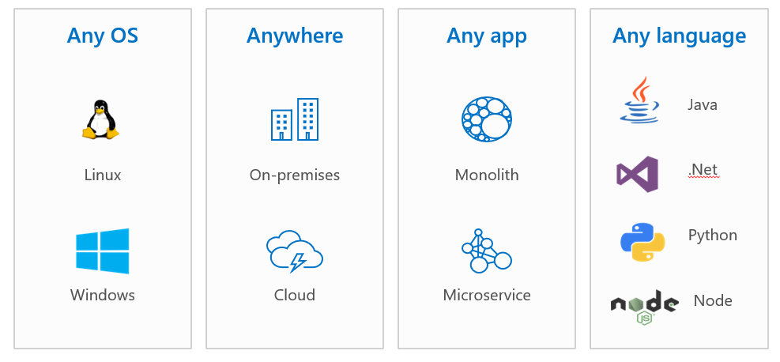

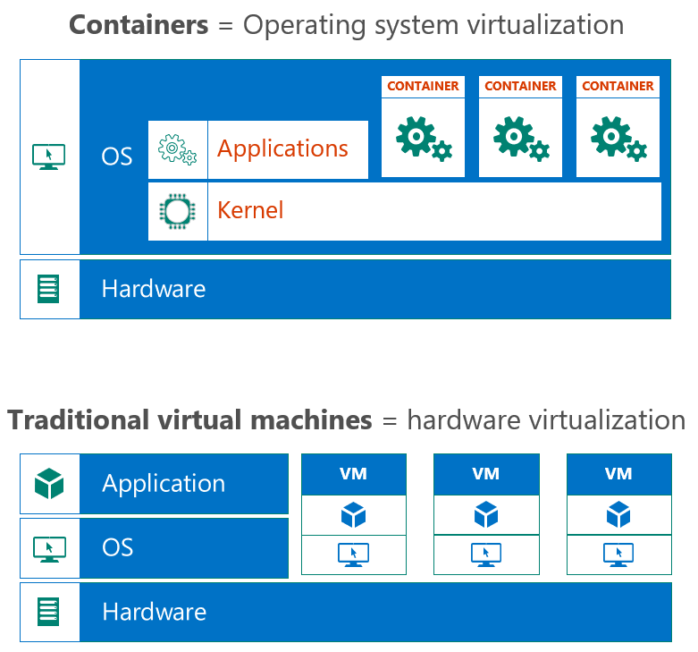

围绕着容器，也衍生出来了很多技术名词，比如 `Docker`, `Docker Image`, `Docker Registry`, `Volume`, `Calico`, `Kubernetes`, `Prometheus`等. 所有的技术都是开源技术，以社区为导向，用户完全可以全部通过虚机创建，自主可控，但同时也需要一个专业的团队来进行管理维护，学习成本跟管理成本都很高，而且，很多时候，这部分平台的建设与维护，并不会给业务带来任何价值，这也是很多公司在考虑用容器服务的时候，会评估并使用公有云提供的托管的容器服务的原因。很容易理解，随着业务系统容器化复杂程度，以及公司容器化平台策略的不同，需要引入的服务也会越来越多，`持久化存储`, `数据库`, `密码管理`, `监控运维`, `持续开发`等，会有越来越多的周边服务被提到，全靠VM来搭，不现实，一定是结合着云端的PaaS服务来一起设计这个架构才能够快速的推进项目的落地。

每个云服务都提供了容器化的服务，Azure也一样。在Azure中，如果定义与容器相关的服务，会很多，但主要用来部署运行容器的服务主要有以下几种 `Azure App Service`, `Azure Kubernetes Service`, `Azure Container Instance`, `Azure Functions`, `托管的商用容器化平台(如 OpenShift & Spring Cloud)`

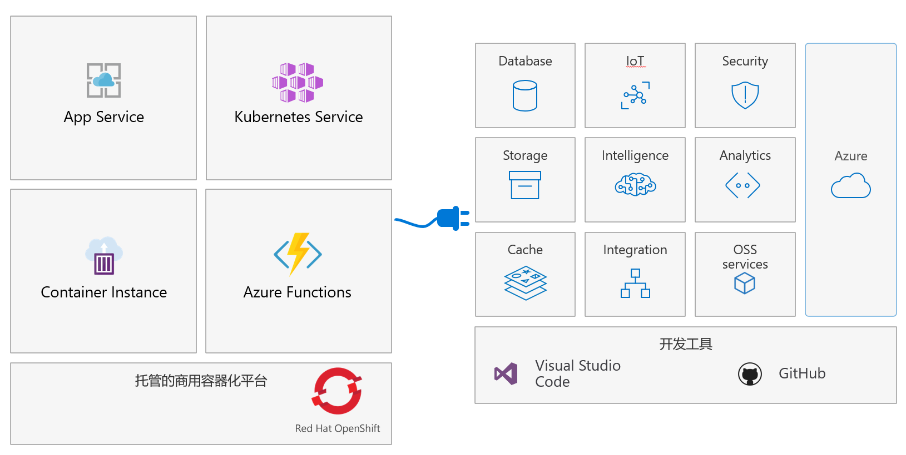

接下来衍生出来的一个问题就是，我到底该选择哪个容器化服务。

一般情况下，并没有一个明确的界限，比如 用户将一个应用网站打包成容器镜像，接下来选择部署的方式时发现，部署在 `Web App` 和 `AKS` 都可以，那到底该选哪一个？针对这样的问题，就没有一个统一的答案，具体要看 `需求`, `企业容器化规划`, `个人喜好`.

大体上，`App Service` 与 `AKS`更多会部署长期运行的应用服务, `ACI` 与 `Azure Functions` 会更多处理随机触发的事件. `Kubernetes`是一个非常火的技术平台，很多人也将其与容器画了等号，但其实`Kubernetes`并不是运行容器，而是管理容器的。因此在选择服务运行在 `App Service` 还是 `AKS` 的时候，可以考虑两个方面的维度

- `应用系统基于容器的部署，是可以通过 Docker Compose 来完成，还是需要通过Kubernetes来完成` : Kubernetes目前算是一个打算上容器时都会遇到的一个技术标准，但也会有人提出，对于一个两个容器实例的运行，Kubernetes太重了，还是Docker Compose更方便，这个时候`Web App for Container`会更合适；当然，如果是复杂的应用，需要考虑多个服务的配合，或者要计划打造容器化平台的话，Kubernetes更适合

- `从容器 Image 的数量上` ：这个听上去有些武断，但判断起来比较直观，如果部署的应用系统是独立的，且只涉及到一两个 `Docker Image`，是可以考虑用 `Web App for Container`的; 但如果部署的系统涉及到多个组件，多个 `Docker Image`, 且有考虑几个应用系统部署到一个环境中，那 AKS 就是不二的选择。因为 Kubernetes 的缺点就是，他是一个平台，必然会涉及到管理组件，而且平台学习曲线比较高，优点就是他是用来做容器编排的，只有容器的数量多了才需要编排，需要管理，在编排方面，他提供了高度扩展的一套管理框架

- `看公司的技术选型及发展规划` : 如果硬要说五个 `Docker Image` 一定不能部署在 `Web App for Container` 中，那就是抬杠了。但具体部署在哪里跟公司的策略有很大关系，如果之前习惯了使用Web App，对其的管理方式，部署槽的使用，CICD的实现都比较熟悉，那当 `Web App for Container`出来之后，对于本质上 `Web App`的使用并没有改变，这就是一个好的选择；但如果公司选型容器平台，准备未来基于容器构建新的系统，那Kubernetes从长远看会更合适

以上感觉都是自己在唠叨，接下来将用几篇文章（具体能写到几篇不知道哈哈），来介绍一下不同的容器服务在Azure上的方案。

今天将要介绍的是 `Azure App Service for Container`, 可参照如下架构图

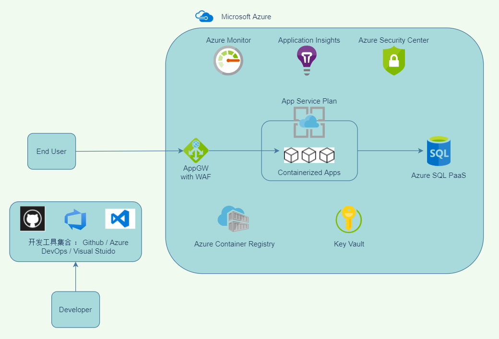

这张图主要涉及到了几个部分: `工具集的完整性` & `服务的连接性及安全性`

接下来将利用一个小的实验，来对 `Contianer in Azure Web App` 进行一个简单的介绍，实验素材可以参见参考资料，实验涉及到的具体步骤，大家可以自行翻阅文档学习尝试。

我觉得这个实验素材特别的好，实验原本是针对于AKS的，涉及到了几个服务，这几个服务彼此之间存在着连接调用的关系，又连接到了后端的数据库。

实验的内容比较简单，就是用户想把本地部署的一个服务，迁移到云端，有两个诉求: 尽量使用 PaaS & 部署在容器中. 实验的前提是已经评估过 `Azure Web App for Container + Azure SQL PaaS`的方案，希望通过PoC进一步的梳理.

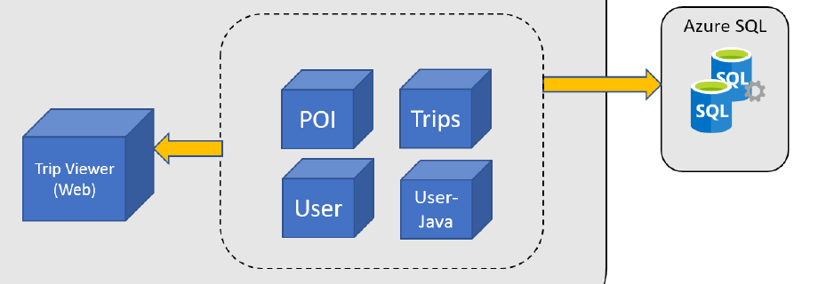

#### 环境准备

需要完成服务的创建, 创建 `Azure Container Registry` & `Azure SQL Database` & `Azure App Service Plan`

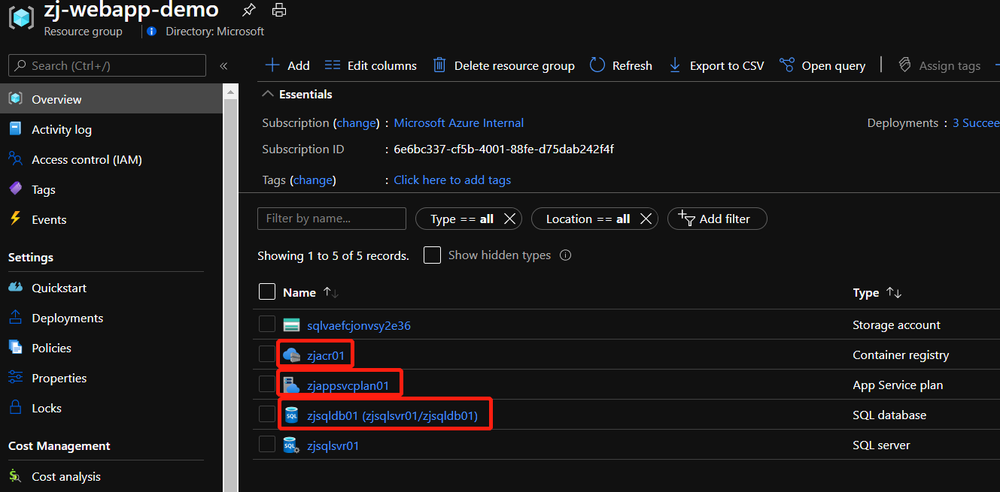

需要 Build `POI` 镜像，并上传到 `Azure Container Registry`

```
# 下载需要Build的源代码及Dockerfile
git clone https://github.com/Azure-Samples/openhack-containers
cd ./openhack-containers/src/poi

# 登录 Azure, 并将整个Build工作提交到ACR, 本地无需 Docker Engine
az login
az acr build -t poi:v1 -r zjacr01 -g zj-webapp-demo -f ../../dockerfiles/Dockerfile_3 .
```

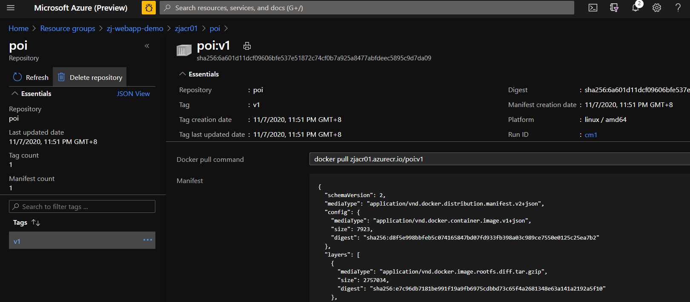

需要对 `Azure SQL Database` 灌入测试数据

```
#运行如下命令将测试数据灌入 Azure SQL Database，灌入测试数据前，记得确保添加正确的防火墙规则，以便可以连接到 Azure SQL Database
sudo docker run -d --name dataload -e "SQLFQDN=$yourConnection" -e "SQLUSER=$yourUser" -e "SQLPASS=$yourPassword" -e "SQLDB=$yourDB" openhack/data-load:v1
```

#### 创建 Web App 服务, 确保运行正常

接下来，我们来通过 `Azure Portal`, 通过上传的镜像, 创建一个应用服务

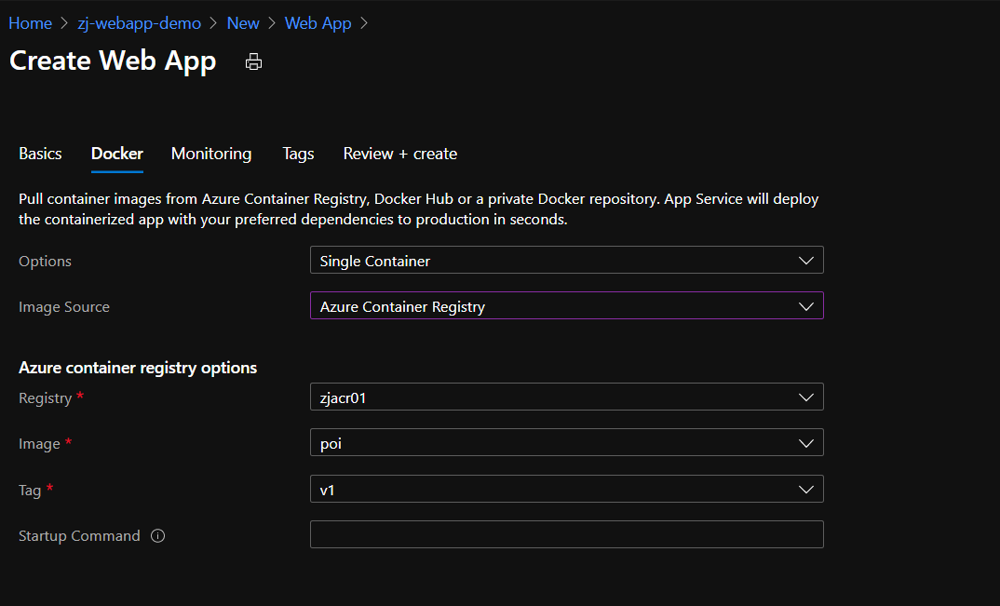

添加 `Docker Image` 运行时所需传入的环境变量

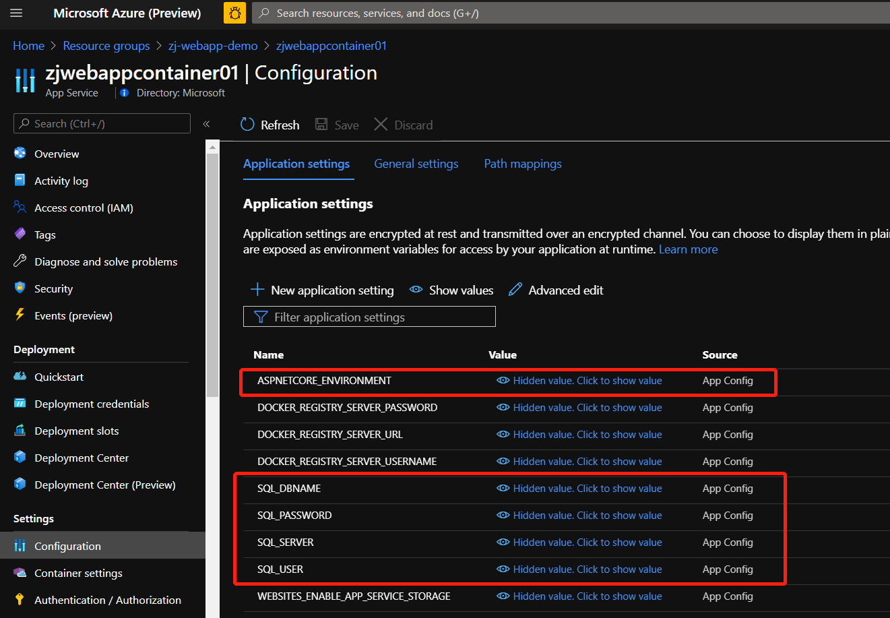

更新完成后, 访问 `$url/api/poi`, 预期结果如下

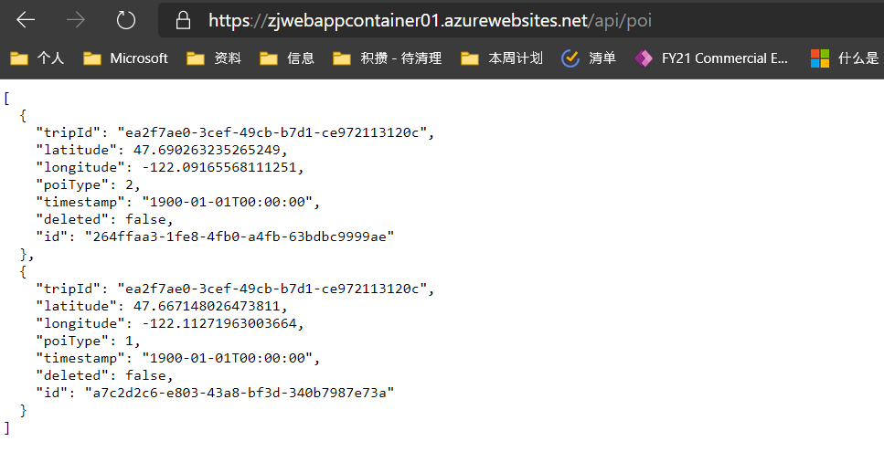

#### 讨论一下，基于此架构，大家比较关心的一些问题

这里比较的不是 `Docker vs Kubernetes`，而是 `VM vs Docker 或者 VM vs PaaS`. 很多过去几年甚至更长时间习惯将系统部署在VM中的用户，往往最关心的就是，我这样部署的好处是什么 ？

从 VM 换到 Container 的最大好处是迁移方便, 确保开发测试出来的应用部署到生产环境后, 跑出来的东西是一样的, 避免在VM本身环境不一致浪费太多时间.

从 VM 换到 Web App for Container 的最大好处是容器化部署的同时，继承了 Web App 的特点：

- 灵活的扩缩容 ： 可根据需要手动或自动的调整计算能力

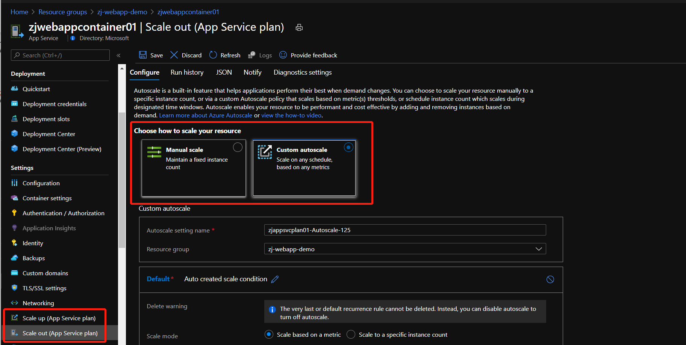

- 可配置的持久化存储

容器的一大好处是 `干掉一个容器的成本特别低`, 一般在Docker中, 如果发现容器运行出错, 最直接的办法就是删掉重建. 但这会有一个问题, 就是一些用户想要持久化保持的东西随着删除重建就会丢失, 所以在容器中会有 `Volume` 的概念, 一个独立的, 可持久存储的文件目录. 

在VM中, `Volume`就是VM中的一个文件夹, 在 Web App 中, 用户也会关心, `Volume`的部分是如何实现的. 目前 `Web App for Container` 也是提供持久化存储的, 用户可以将持久化文件存储在 `/home` 目录下, 并映射到容器中, 但前提是预先开启配置 `WEBSITES_ENABLE_APP_SERVICE_STORAGE`

当然，VM中常见的另外一种需求就是, 一个应用服务中会包含多个服务, VM中很容易做到, 容器中该如何做? 可以理解为多个服务就是多个容器实例, 在Docker中, 就是通过Docker Compose来做的, Docker Compose会将一组容器服务组织起来, 并确定彼此之间的调用关系.

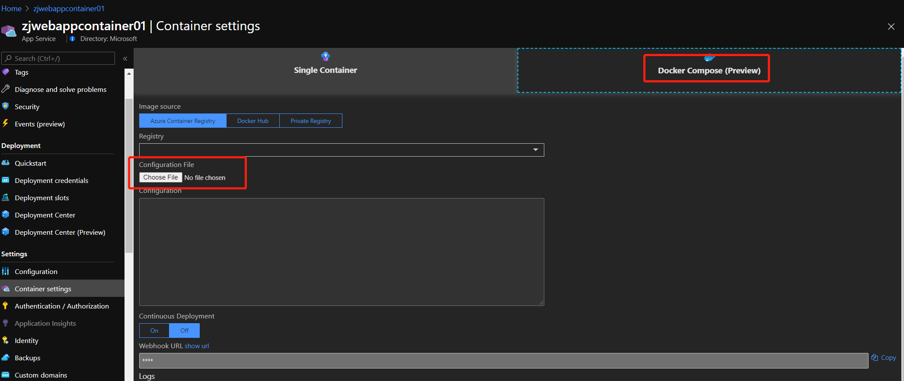

- 监控

通过 Azure Monitor, 平台提供了针对 Web App 的 Metrics, 并能够针对这部分的 Metrics 进行告警

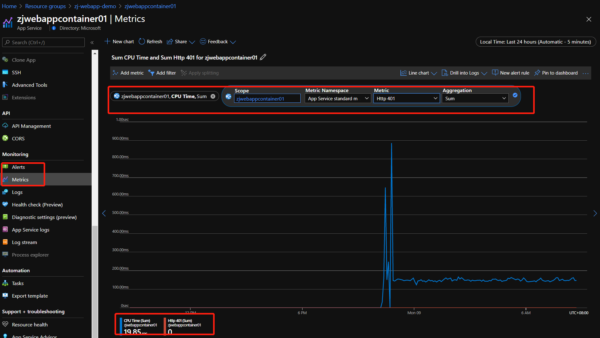

当然，默认提供的算是标准的监控信息, 如果想要获取更详细的信息, 包括一些访问日志, 可以设置诊断日志, 并发送到 `Azure Log Analytics`

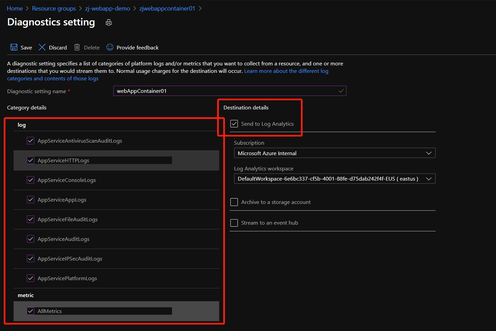

对于容器内部日志, 如果想要实时查看的话，可以通过配置来完成

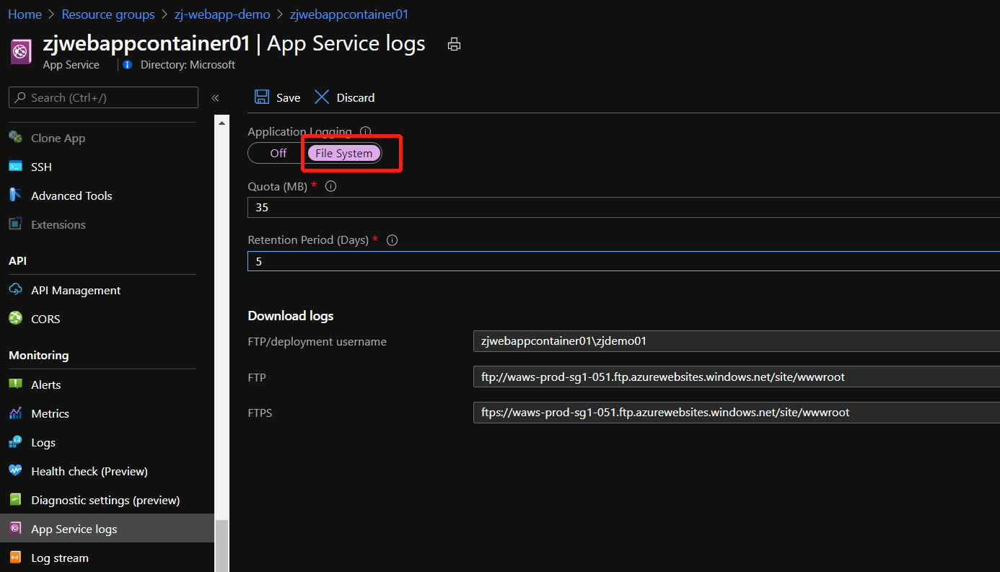

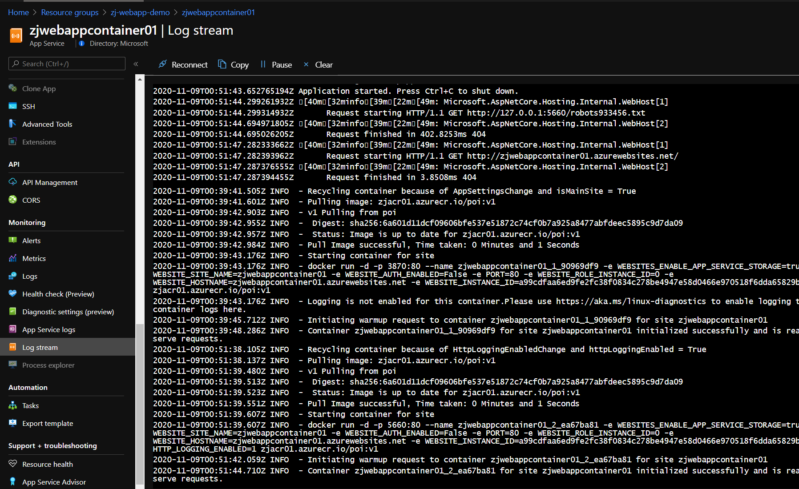

- 安全

这个话题特别的大, 设计了多个服务, 如果只看 `Web App` 的话, 有三点是容器相关的

1. 针对OS层面的更新及安全补丁, 由平台维护而非用户

2. 容器镜像的安全, 包括了基础镜像的安全更新后, ACR也会更新基础镜像, 镜像的安全扫描, 这部分是 ACR 所提供的

3. 容器运行中, 需要调用的密码等, 例如调用 `SQL PaaS` 时需要的密码, 这部分就可以结合 `Managed Identity & Azure KeyVault`来完成

第一步，Enable Managed Identity, 这里先使用 System Assigned 就可以

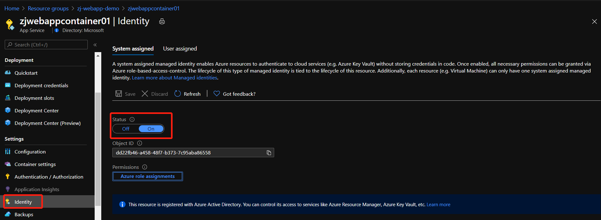

第二步，在 Azure Key Vault 设置 `Access Policy` , 将SQL PaaS的密码存储在 `Key Vaults`, 并添加对于 `Secrets` 访问权限

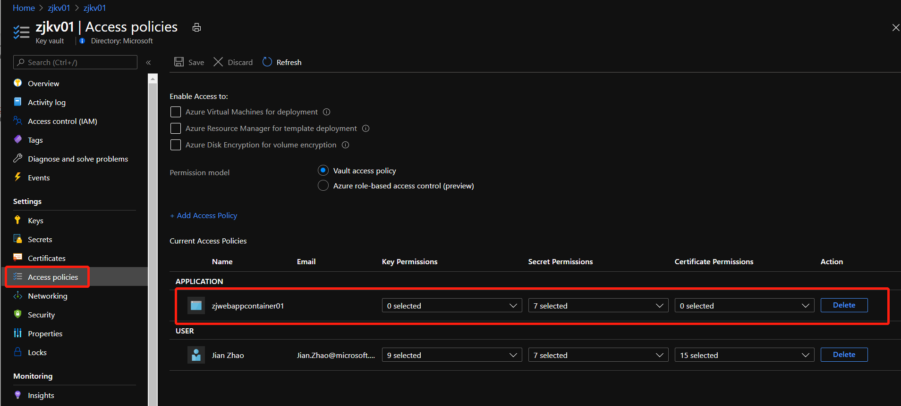

第三步, 在 `Web App Application Setting` 中, 使用 `Azure Key Vaults`

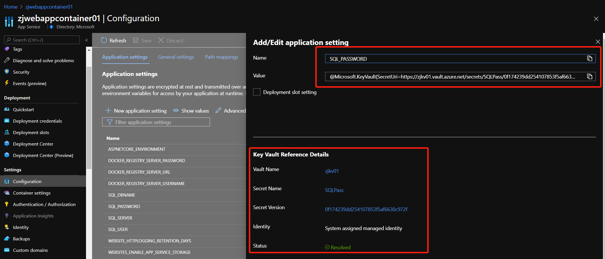

这样，所有密码都存在了`Key Vaults`中.


到这里, 这个Demo就基本结束了, 我们可以看到, 如果只有几个容器准备部署, 或者说本来你就觉得Kubernetes太重, 打算直接拿`Docker Run & Docker Compose`来运行的话, 那 `Web App for Container` 还是比较合适的, 但我们同时也看到, 很多 Kubernetes 中涉及到的管理概念, 比如 `Replica / Secret / Configmap / Persist Volume`等, 这部分在Web App中还是弱化的, 也好理解, 当一个环境中, 资源或人员相对较少的时候, 并不需要复杂的流程和规章制度, 只有发展到一定阶段或一定数量, 一个完善的流程和制度会确保环境运行的成功.

### 参考资料

- [实验中涉及的基础Dockerfile包](https://github.com/Azure-Samples/openhack-containers)

- [使用自定义容器将自定义软件迁移到 Azure 应用服务](https://docs.microsoft.com/zh-cn/azure/app-service/tutorial-custom-container?pivots=container-linux)

- [在 Azure 中运行基本的 Web 应用程序](https://docs.microsoft.com/zh-cn/azure/app-service/tutorial-custom-container?pivots=container-linux)