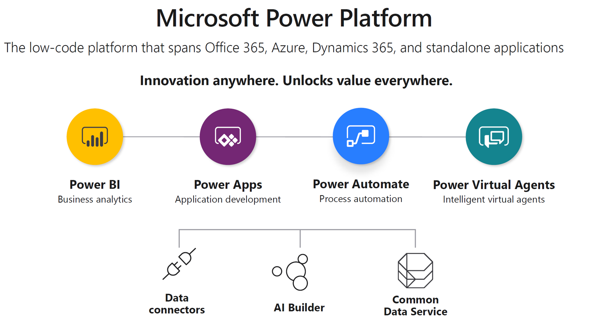
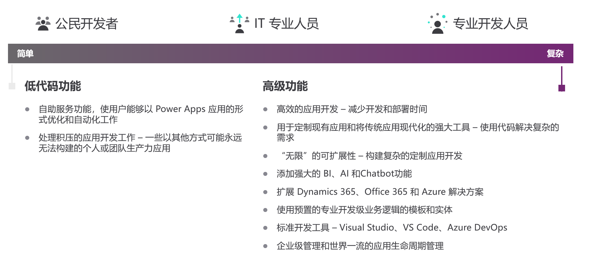
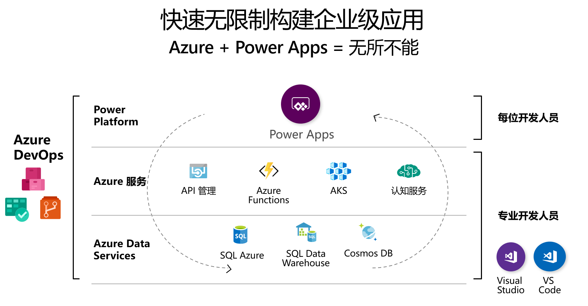
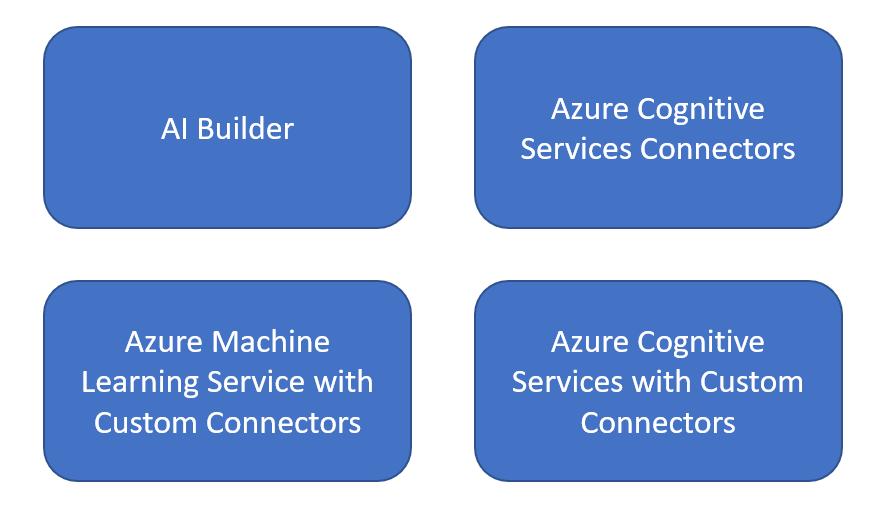
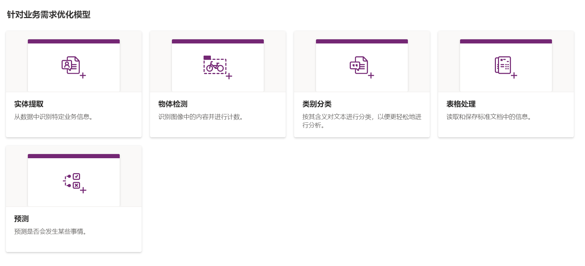
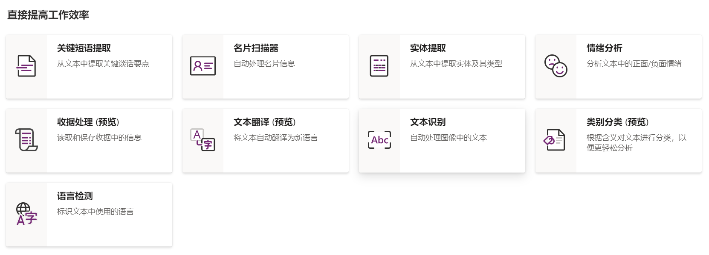
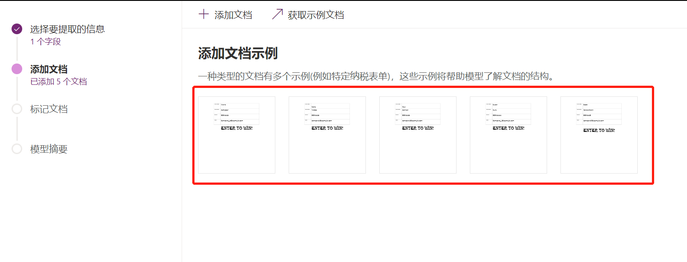
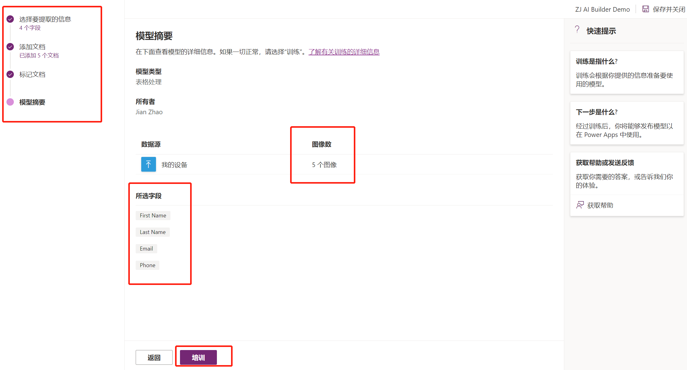
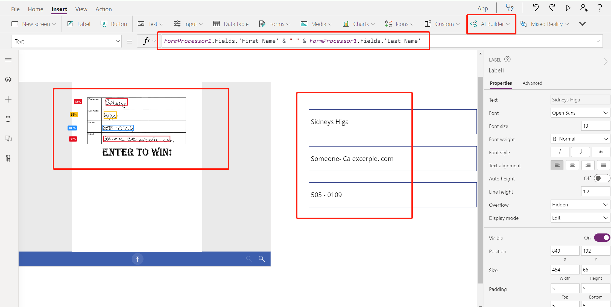

## Power Apps 与 Azure 服务的对接 （一）

最近在做一些实验，其中有一些涉及到 Power Apps 中的功能实现, 是通过调用 Azure 中的服务来完成的。正好借这个机会，整理一下, 抛个小砖, 希望能够启发到小伙伴们的思维.

Power Apps 是低代码开发平台 Power Platform 中的一个服务, 用来快速开发业务应用, 尤其是移动端应用. Power Platform 作为一个地代码开发平台, 包含如下服务：

Power Platform 中的服务, 虽然提供了很好的低代码开发体验, 但要想将低代码开发平台的能力最大化, 利用低代码来解决企业的需求, 加速应用的开发, 与外部平台的对接是必不可少的. 这种对接, 不单纯是数据层面的对接, 更是功能上的互补. 也体现了, 低代码开发工具的出现, 不是对于专业程序员的挑战, 而是参与应用开发的不同角色, 更为专注的干好自己的活. 在低代码应用开发中, 常常会有三个角色 : `公民开发者`, `IT 管理员`, `专业开发者`, 大家各司其职, 加速企业应用的开发.

整理了一下 Power Apps 与 Azure 上服务的对接方式, 来看下, Azure 的服务能够帮助 Power Apps 干什么.

这张图其实挺好的, 体现了大体上 Power Apps 与 Azure 服务结合的几个方面：

- 与 Azure 中 AI 服务的对接, 如 `Azure Cognitive Services` & `Azure Machine Learning Service`, 扩展应用的AI能力.
- 与 Azure 中 应用服务对接, 如 `Azure Function` & `Azure Kubernetes Service` & `Azure Container Instance` & `Azure Automation`, 扩展平台服务能力, 快速处理复杂业务逻辑.
- 与 Azure 中 运维管理服务对接, 如 `Azure DevOps` & `Azure Application Insights`, 提升 Power Apps 自身 `应用生命周期管理` 的能力.
- 与 Azure 中 数据服务的对接, 如 `Azure SQL` & `Azure CosmosDB` & `Azure Synapse`, 既能够做到快速的数据打通&数据读取, 同时也可以做到快速调用分析后的数据, 进行操作.

下面, 开始第一部分 `对接 Azure AI 服务` 的介绍

Power Apps 开发的应用, 想要获得 AI 的能力, 主要以下几个方式：

### Demo 1 利用 AI Builder, 实现快速的表单识别

`AI Builder` 是 Power Platform 中提供 AI 功能的模块, 提供了如下的 AI 能力

`AI Builder` 的使用非常简单, 从训练模型到应用开发, 只需准备好测试数据, 10分钟就可以搞定. 以 `表单识别` 为例, 

#### 第一步 准备并上传 测试数据, 训练模型

只需要准备5份格式相同的文档, 就可以开始训练. 训练结束后, 保存并发布模型, 后续随着数据的增多, 可以不断优化训练调整模型. 完整的实验手册请参阅参考文档.

#### 第二部 将训练好的模型, 应用到 Canvas App 中

添加 AI Builder 到应用中非常简单, 只需要插入 Component 并选择好所需要的模型, 剩下的, 就是看怎么利用好识别出来的数据. 可能在最初的时候, 模型训练有些不精准, 可以提供更多的训练数据进行校准, 例如: 实验中训练时都是打印体, 但使用时, 测试用了手写体, 就可以将手写体的测试文件也加入模型的训练, 增加准确率.

### Demo 2 利用 Azure Cognitive Services Connector

AI Builder 是实现 AI 能力最方便的方式, 但如果我们想要的一些AI功能, 没有包含在里面, 这个时候就可以使用 Azure Cognitive Services Connector, 对接 Azure 中的认知服务. 每一个支持的 Azure Cognitive Service Connector, 都已经封装好了一些常见且支持的功能, 方便上手. 这里就

### 参考文档

- [教程：使用 AI Builder 创建表单处理应用](https://docs.microsoft.com/zh-cn/azure/cognitive-services/form-recognizer/tutorial-ai-builder#:~:text=AI%20Builder%20is%20a%20Power,table%20data%20from%20form%20documents.)

