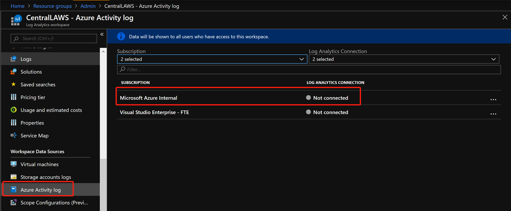
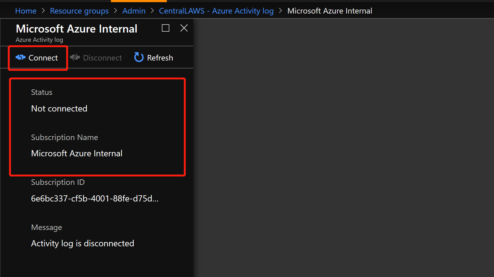

## WIP - Azure 监控平台 Whitepaper & Handson

---
### HOL01 了解Azure中监控数据平台的层次，及各层次能够收集到的数据

Azure中监控的数据主要为 `Metrics` & `Logs`， 监控包括 `Tenant(租户)` & `Subscription（）` & `IaaS()` & `Container()` & `PaaS（）` & `客户自定义数据`等不同层级的资源，
  提供一致性的`监控` & `分析` & `可视化` & `警报`等功能。


### 数据的种类

- `Metrics` 是时序数据，包含一个时间戳和数值，形如`"Percentage CPU": {"average": 0.57,"timeStamp":"2019-06-13T13:00:00+00:00"}`，定期收集，能够快速反应环境中出现的问题，如“CPU过高”，可以根据合理的`Metrics`设置报警，以便在环境出现问题时快速响应； `Metrics`的访问可以
  集中通过 `Metrics Explorer`进行查询， 可以通过`Azure Dashboard`创建一个定制化的大屏，能够体现资源整体的运行情况；
  
  `Metrics` 主要包含三个维度
  
  - `平台指标 （无需任何配置）` ：  反映资源的运行状况和性能；
  - `Guest OS Metrics (特指VM，需要配置诊断设置)` ：  通过Extension的Agent收集；
  - `容器 Metrics （特指AKS，需要额外开启Addons）` : 通过Agent进行收集；
  - `额外需要配置诊断设置的 Azure服务`
  - `应用程序数据 （需要集成Application Insights）`
  - `自定义指标 (需遵循平台配置指南)` ：  收集非平台的指标，比如用户在虚机中安装了MySQL，收集MySQL的一些指标；或用户想收集本地虚机的指标等；
  
  `Metrics` 大多数资源的指标数据保留93天，用户可以导出到存储账户进行存档保存；
  
  更多详细信息 ： 
  - [Azure中的Metrics介绍](https://docs.microsoft.com/zh-cn/azure/azure-monitor/platform/data-platform-metrics)  
  - [Azure平台中不同服务支持的 Metrics](https://docs.microsoft.com/zh-cn/azure/azure-monitor/platform/metrics-supported)

- `Logs` 是详细的信息记录，包含更多的信息，主要用于对出现的问题进行具体的分析；日志不同于指标，虽然按照时间顺序进行汇总，但不是按固定事件间隔进行收集发送； 建议将所近期日志
      （一个月或三个月）放入 `Log Analytics` 中保存分析，这样可以多维度的分析问题或获取见解，将长期数据（三个月以上）放入存储账户进行存储，以符合不同要求的合规性，审查或用于长期
    分析。 
  
  Azure Monitor中提供了 `Log Analytics` 的服务，用于对日志进行查询分析； `Log Analytics` 使用Kusto语言进行查询； `Log Analytics`的日志数据均存储在`Log Analytics workspace`
      中，且 `Application Insights` & `Azure Security Center` & `Azure Sentinel` 收集的日志存储在其内置的workspace中，但可以跨workspace进行分析；
    
  Azure中的日志主要包括 管理层的 `Azure AD Audit Logs` & `Azure Activity Log`; 资源层面的 `支持Diagnostics Settings的资源的诊断日志` & `虚拟机 Extension收集的性能及自定义日志`
    & `容器的日志数据` & `Application Insights中收集的应用程序请求&异常等详细数据， 使用情况等`； 支持通过多种手段将第三方日志导入到 `Log Analytics`;
  
    一般情况下，资源产生的日志数据与Azure Monitor之间会有 2-5 Mins的延迟，主要是因为
  
    更多详细信息：
    - [Azure中日志介绍](https://docs.microsoft.com/zh-cn/azure/azure-monitor/platform/data-platform-logs)
    - [Azure中查询语言入门](https://docs.microsoft.com/zh-cn/azure/azure-monitor/log-query/get-started-queries)
    - [影响日志数据传入Azure Monitor的因素](https://docs.microsoft.com/zh-cn/azure/azure-monitor/platform/data-ingestion-time)

### 能够收集的不同层面的资源

一般情况下，一家公司是处于一个Tenant中，通过创建不同的订阅，并在订阅下创建不同的资源。


- Azure Tenant相关的数据 ：主要为 __*Azure Active Directory 审核日志*__ ，Azure AD的全局管理员才能够进行设置，具体设置可参照 [将 Azure AD 日志集成与 Azure Monitor 日志](https://docs.microsoft.com/zh-cn/azure/active-directory/reports-monitoring/howto-integrate-activity-logs-with-log-analytics), 将日志导入到特定的Log Analytics workspace中，并依照存储建议对数据进行存档；

- Azure Subscription相关数据：主要为 __*Activity Log*__ & __*Service Health*__

  - Activity Log ：收集所有针对资源的操作记录及资源的运行状况，例如：创建一个虚拟机，产生相关的活动日志记录虚拟机的创建过程及创建者；当平台对服务进行维护或某一资源的状态发生改变，也会创建一条活动日志记录发生的变化，如下所示：

    

    

    用户可以针对不同类别的Activity Log进行告警设置，及早知道环境中发生的变化；可参照 [收集和分析 Azure Monitor 的 Log Analytics 工作区中的 Azure 活动日志](https://docs.microsoft.com/zh-cn/azure/azure-monitor/platform/activity-log-collect)将活动日志配置到特定的Log Analytics workspace中，并依照存储建议对数据进行存档; 默认 Activity Log的保存期为90天。

    活动日志记录了包括 `Administrative` & `Service Health` & `Resource Health` & `Alert` & `Autoscale` & `Recommendation` & `Security` & `Policy` 在内的多种类型的事件，同时提供多种filter，帮助用户调查在Azure订阅级别下，资源或环境中发生的事情；

    更多资料参考：
    - [活动日志中的类别](https://docs.microsoft.com/zh-cn/azure/azure-monitor/platform/activity-logs-overview#categories-in-the-activity-log)

    - [Azure 活动日志事件架构](https://docs.microsoft.com/zh-cn/azure/azure-monitor/platform/activity-log-schema)

  - Azure Service Health : 服务运行状况的数据实际上是存放在活动日志中，用户可以登陆到特定页面 `Monitor - Service Health` 中了解到包括近一段环境中出现的服务相关的问题及RCA报告，平台计划的Maintenance等，并可设置响应的告警，以便第一时间知道平台的哪个服务出了问题，详细介绍请参照 [使用 Azure 门户查看服务运行状况通知](https://docs.microsoft.com/zh-cn/azure/azure-monitor/platform/service-notifications)

    

- Azure Resources ：主要为 __*Metrics*__ & __*Logs*__ ,另外包含针对于虚机的 `Guest OS` & `Azure Monitor for Container`

  - Metrics : 如上面介绍，指标是能够反应Azure服务可用性及性能的参考；大家比较好理解的是对虚机进行指标收集，Metrics除了支持IaaS资源外，还支持平台中的PaaS服务，且使用第一方的方式收集Metrics，更为简单，快速，稳定；部分IaaS服务&PaaS服务需要开启诊断日志，以支持指标的收集，用户在创建资源的时候记得打开诊断日志，以便更好的了解创建的服务；

  - Logs ：主要针对诊断日志，不需要代理并从 Azure 平台本身捕获特定于资源的数据；Azure资源的诊断日志默认是不开启的，需要在创建过程中或使用过程中开启，且指定到特定的Log Analytics workspace中，并依照存储建议对数据进行存档；并不是所有的服务都支持诊断日志，具体支持列表请参考 [Azure 诊断日志支持的服务、架构和类别](https://docs.microsoft.com/zh-cn/azure/azure-monitor/platform/diagnostic-logs-schema)；

    > __*注意：*__ 由于AzureDiagnostics 中列限制 “包含的列数不超过 500 个的任意给定 Azure 日志表具有明确的限制。 一旦达到该限制，在引入时，包含不属于前 500 个列的数据的行将被删除。”；当一个Project用到的资源类型过多，一定要计算一下需要的列数，并合理规划workspace；

  - Guest OS : 通过不同的 Extension 来收集 Guest OS 的指标数据，主要针对于 Azure VM 及 On-Prem VM

    - Azure Diagnostics Extension : 主要收集 Azure VM 中的指标数据；

    - Log Analytics Agent : 主要通过Agent收集 Windows/Linux 自定义数据，VM可以为Azuge VM，也可以是本地 On-Prem VM

    - Azure Monitor for VM ：主要提供对于Azure虚机的运行状况指标，提供针对于Azure/非Azure虚机的性能及Service Map指标；运行状况条件指标存储在 Azure Monitor 中时间序列数据库、 收集性能和依赖关系数据存储在 Log Analytics workspace 中。
  
  - Azure Monitor for Container : 提供针对AKS数据的收集，主要收集AKS集群的指标并发送到Azure Monitor，可在 Metrics Explorer中进行查询；提供针对AKS集群的日志数据，包括实时的Pod日志；

- Application 数据 ：Azure Monitor中的Application Insights是一款智能APM工具，能够提供对支持的框架开发的应用程序进行数据的收集，且不论应用程序部署在Azure还是本地；Application Insights安装检测包后，会收集与应用程序的性能和运行相关的指标和日志，并发送到Azure，保存在Application Insights Instance专属的Log Analytics workspace中；

__*注意 : 将数据传入到Azure Monitor或是Log Analytics会存在一定时间的延迟*__

[不同数据一般情况下延迟时间](https://docs.microsoft.com/zh-cn/azure/azure-monitor/platform/data-ingestion-time)


# 收集数据的手段 - WIP with ZJ

- ToDo : 平台自身

- ToDo : Agent https://docs.microsoft.com/zh-cn/azure/azure-monitor/platform/agents-overview

- ToDo : 应用程序

- ToDo : 自定义指标 https://docs.microsoft.com/zh-cn/azure/azure-monitor/platform/metrics-custom-overview


# 环境准备 - WIP with ZJ

本次实验，选取了两个既有的部署脚本，分别部署了基于 `IaaS (虚机&SQL VM) + MongoDB VM` 进行构建的网站，以及基于 `AKS & Azure PaaS` 构建的网站，作为Cover以下实验的运行环境。

#### Demo Project02 Tailwind Traders Website (前端使用 Azure Web Apps, 后端基于 AKS & Azure SQL & Azure CosmosDB)

__*Step 1 Setup Azure Infrastructure for Tailwind Traders Website*__

```
# 如果还未准备好 Azure Service Principle, 请创建一个
az ad sp create-for-rbac -n "monsp"

# 查看区域支持的Kubernetes版本，ARM模板中默认的版本已经 out of scope，以区域 westus2 为例
az aks get-versions -l westus2 -o table

# 点击 Guide 中的 Deploy to Azure，部署到 Global Azure 中

# 在 PostgreSQL 中创建 DB stockdb
az postgres db create -g $yourRG -s $yourPostgreSQL -n stockdb

# 连接创建的AKS集群
az aks get-credentials -n $yourAKS -g $yourRG

# 配置 Helm Tiller

```


__*参考资料：*__

- [Deployment Guide for Azure Infrastructure](https://github.com/microsoft/TailwindTraders-Backend/blob/master/Documents/Azure-Deployment.md)

- [Deployment Guide for Backend on AKS](https://github.com/microsoft/TailwindTraders-Backend/blob/master/Documents/DeploymentGuide.md)


- https://github.com/rkuehfus/AzureMonitoringHackathon 

- 安装MongoDB https://github.com/olmosleo/mongodb-replica-set-centos/blob/master/nested/primary-resources.json

- [Tailwind Traders Website](https://github.com/Microsoft/TailwindTraders-Website)

目前实验环境暂时支持 Global Azure 的部署，如果需要部署在 Azure Mooncake, 需要重新 consolidate 下现有的部署脚本。

__*Step 2 准备 Ansible 环境*__

```
# 准备WSL或一台Linux虚机，例如：Ubuntu 16.04

# 安装 Ansible on Ubuntu 16.04 with Azure Module
sudo apt-get update && sudo apt-get install -y libssl-dev libffi-dev python-dev python-pip
sudo pip install ansible[azure]

# 创建 Azure Service Principle
az ad sp create-for-rbac

# 在当前目录创建文件 
touch ~/.azure/credentials

# 在文件中填入以下值
[default]
subscription_id=<your-subscription_id>
client_id=<security-principal-appid>
secret=<security-principal-password>
tenant=<security-principal-tenant>
```

由于Ansible不是本次Handson的主要介绍内容，更多资料请参照：

- [Using Ansible with Azure](https://docs.microsoft.com/en-us/azure/ansible/ansible-overview)

- [Ansible中支持的Azure Module](https://docs.ansible.com/ansible/latest/modules/list_of_cloud_modules#azure)

- [一些Azure相关的Ansible Playbook](https://github.com/Azure-Samples/ansible-playbooks)

__*注意 ：*__ 使用Ansible是为了更好的对部署的资源进行管理，与模板分离；很多时候我们部署的模板都是一个，但变量的名称各不相同，通过Azure Ansible的vars，结合Ansible Playbook可以更好的协调 Azure ARM Template 及 部署资源之间的管理。

#### Chn01 规划创建使用的 Log Analytics workspace

本次实验，将会通过 `ARM Template` 结合 `Ansible`部署出环境需要的 `Log Analytics workspace`.

本次实验的规划思路为：

- 订阅级别的 Activity Log 建议放在单独的 Log Analytics workspace 中

- 订阅下的 Azure Resources，建议以 Project 为单位进行划分

本次实验，将创建名为 `activityLogWS` & `projectOne` 的两个 workspace。

所有Workspace的创建，均通过 Ansible Playbook，所有需要创建的 workspace，均定义在 [loganalytics.yml](./files/monitor/monitor-ansible/vars/loganalytics.yml), 例如：

 

```
# 进入 Ansible Playbook 目录
cd ./files/monitor/monitor-ansible

# 预先定义好要创建的workspace后，运行playbook
ansible-playbook ./deploy-loganalytics.yml
```

参考资料 : [使用 Azure CLI 2.0 创建 Log Analytics 工作区](https://docs.microsoft.com/zh-cn/azure/azure-monitor/learn/quick-create-workspace-cli)

#### Chn02 配置将 Activity Log 发送至 Log Analytics workspace

配置 Activity Log 到 workspace 只需要两步 ：

__*Step 1 进入已创建的 workspace activityLogWS*__



__*Step 2 点击 需要设置的订阅，点击 Connect，配置Log Analytics workspace的信息*__



将活动日志保存在Log Analytics中是为了更好的进行数据的分析，活动日志到达Log Analytics存在一定的延迟，一般情况下，将活动日志数据发送到 Log Analytics 引入点大约需要 10 到 15 分钟。

#### Chn03 配置开启资源中的诊断日志，并将诊断日志配置到 Log Analytics workspace

并不是所有的资源都支持诊断日志，请参考上文中的链接，获取支持诊断日志的服务。

建议在生产环境中开启资源的诊断日志，以便在出现问题时，能够有更多的数据分析根本原因。默认诊断日志是不开启的，因为开启诊断日志会需要选择存储的位置，会存在一些成本的开销。可以手动的开启诊断日志，且为了更为自动化的判定环境中哪些服务没有开启诊断日志，后续的实验中，有针对于使用Policy帮助Audit资源是否开启诊断日志，从而帮助我们监控环境中诊断日志的开启情况。

诊断日志可以存储在 `存储账户` & `Event Hub` & `Log Analytics`，建议将诊断日志存储于Log Analytics workspace中，并按照统一的日志数据策略进行存档。

我们可以通过 `Azure Monitor - Diagnostics Settings` 中查看到诊断日志的设置状态


本次实验将通过 Azure CLI，实现针对 Diagnostics Settings 的设置；

```
# 设置某一资源的Diagnostics Setting
az monitor diagnostic-settings create -n $yourSetName --workspace $yourWSName --resource $yourResourceId --logs '@$yourResourceSupportedLog.json' --metrics '@yourResourceSupportMetrics.json'
```

__*注意*__ 针对上面的模板命令，有两点需要强调

- Diagnostic Settings 的名字建议以`Name-Resource-diag`这种类型，方便查询时直观理解

- 命令中提到的有两个参数 `--logs` & `--metrics`，这两个参数并不一定所有的资源都支持，有的支持Logs，有的支持Metrics，有的都会支持，而且支持的Type各有不同; 如果环境中仅有少量的资源需要配置诊断日志，建议直接通过Portal进行配置，点击 `Azure Monitor - Diagnostis settings` 设置资源的诊断日志；如果有大量的资源，建议总结好 `--logs` & `--metrics` 的模板，以备后面复用；

__*请将实验环境中的所有 Diagnostic Settings 全部设置好*__，接下来，我们将以环境中的 `KeyVault`为例，进行设置；

KeyVault 支持的 Diagnostic settings 中需要设置的logs & metrics的模板，放入了 [keyvault-metric-diag.json](./files/monitor/diag-settings-sample/keyvault-metric-diag.json) & [keyvault-log-diag.json](./files/monitor/diag-settings-sample/keyvault-log-diag.json)

```
# 在实验环境中，我们包含了一个KeyVault，名为 'kvyfo4nigwm222u'
# 查询这个 KeyVault的 Resource ID
az keyvault show -n $your_kv_name -g $your_rg | jq -r .id

# 打开 KeyVault的诊断设置
az monitor diagnostic-settings create -n $kvName --workspace $wsName --resource '$resourceId' --logs '@demo-logs.json' --metrics '@demo-metrics.json'
```

资料参考：

- [如何在Portal设置诊断日志](https://docs.microsoft.com/zh-cn/azure/azure-monitor/platform/diagnostic-logs-stream-log-store#stream-diagnostic-logs-using-the-portal)

#### Chn04 Service Fabric & VM 设置 Diagnostic settings 到存储账户，再设置Log Analytics从存储账户中读取数据

Azure中有三个特殊资源，常用的主要为 `Service Fabric` & `VM`, 他们设置诊断日志的时候，只能存储在Storage Account中。为了将数据可以集中于Log Analytics，我们可以在设置到存储账户后，设置Log Analytics，从存储账户中读取日志信息，以供后续的分析。我们可以在环境中按照项目，设置存储账户用来收集诊断日志信息。

配置VM诊断设置请参照 ：[在虚拟机中为事件日志和 IIS 日志收集启用 Azure 诊断](https://docs.microsoft.com/zh-cn/azure/azure-monitor/platform/azure-storage-iis-table#enable-azure-diagnostics-in-a-virtual-machine-for-event-log-and-iis-log-collection)

配置Log Analytics读取存储账户中的日志请参考 ：[使用 Azure 门户从 Azure 存储中收集日志](https://docs.microsoft.com/zh-cn/azure/azure-monitor/platform/azure-storage-iis-table#use-the-azure-portal-to-collect-logs-from-azure-storage)

#### Chn05 通过 Log Analytics agent，收集更多 VM 中的 日志及指标

- ToDo 代理的介绍 : https://docs.microsoft.com/zh-cn/azure/azure-monitor/app/performance-counters

通过代理，可以收集更多的自定义的信息，可以在 [Azure Monitor 中的代理数据源](https://docs.microsoft.com/zh-cn/azure/azure-monitor/platform/agent-data-sources)查看平台支持的数据源及格式；


设置 Azure VM 中的 Log Analytics agent很简单，只需要两步

Step 1 进入创建的workspace `projectOne`, 点击 `Workspace Data Sources下的Virtual machiens`

你会发下 VM `db-1` 没有配置agent，连接到Log Analytics


Step 2 进入后，点击 `Connect` 即可，系统会自动帮VM配置并安装 Log Analytics agent


---
# WIP with WXS

- ToDo : 收集 Syslog https://docs.microsoft.com/zh-cn/azure/azure-monitor/platform/data-sources-syslog - with WXS

- ToDo : 收集 MySQL 应用程序性能 https://docs.microsoft.com/zh-cn/azure/azure-monitor/platform/data-sources-linux-applications - with WXS

- ToDo : 收集 自定义日志 (MongoDB) https://docs.microsoft.com/zh-cn/azure/azure-monitor/platform/data-sources-custom-logs - with WXS

#### Chn06 通过 InfluxData Telegraf 代理收集 Linux VM的自定义指标 - with WXS

- ToDo : 收集自定义指标 （MongoDB） https://docs.microsoft.com/zh-cn/azure/azure-monitor/platform/collect-custom-metrics-linux-telegraf


---
# WIP with ZJ

#### Chn06 开启 AKS 的监控插件 with ZJ

- ToDo : 如何开启AKS监控（现有集群）https://docs.microsoft.com/zh-cn/azure/azure-monitor/insights/container-insights-onboard


---
# WIP with ZRJ

#### Chn07 通过 Application Insights 监控应用程序

- ToDo 引入SDK，标准的收集HTTP信息 https://docs.microsoft.com/zh-cn/azure/azure-monitor/app/asp-net
- ToDo 自定义收集信息
- ToDo 收集业务信息 https://docs.microsoft.com/zh-cn/azure/azure-monitor/app/usage-send-user-context
- ToDo 监控Kubernetes中的应用程序 https://docs.microsoft.com/zh-cn/azure/azure-monitor/app/kubernetes  / https://github.com/Microsoft/Application-Insights-Istio-Adapter/blob/master/SETUP.md#faq

Tips : 找到支持的应用配置 : https://docs.microsoft.com/zh-cn/azure/azure-monitor/app/azure-web-apps

---


---
# With ZJ

### HOL 了解环境中运行资源的Insights 

#### Chn01 总体环境监控

- ToDo 环境中的概况 （资源的数量，各类型资源的数量，警报数量，服务健康数量）

#### Chn02 虚机&存储监控

- ToDo https://docs.microsoft.com/zh-cn/azure/azure-monitor/insights/vminsights-overview / https://github.com/asheniam/azure-grafana-dashboard-templates/tree/master/microsoft-compute-virtualmachines/overview

- ToDo https://github.com/asheniam/azure-grafana-dashboard-templates/tree/master/microsoft-storage-storageaccounts-blobservices/overview / https://github.com/asheniam/azure-grafana-dashboard-templates/tree/master/microsoft-storage-storageaccounts/overview 

#### Chn03 网络性能监控

- ToDo : https://docs.microsoft.com/zh-cn/azure/azure-monitor/insights/network-performance-monitor

#### Chn04 容器监控

- ToDo AKS 容器的监控 Insights https://docs.microsoft.com/zh-cn/azure/azure-monitor/insights/container-insights-overview

- ToDo AKS-Engine 容器的监控 Insights https://docs.microsoft.com/zh-cn/azure/azure-monitor/insights/containers

---


# Later 

### HOL 完善环境中的警报机制及后期采取的行动

#### Chn01 规划 Action Group

- ToDo : Email / SMS https://docs.microsoft.com/zh-cn/azure/azure-monitor/platform/action-groups

- ToDo : WebHook https://docs.microsoft.com/zh-cn/azure/azure-monitor/platform/activity-log-alerts-webhook

- ToDo : LogicApp https://docs.microsoft.com/zh-cn/azure/azure-monitor/platform/alerts-common-schema-integrations

#### Chn02 设置警报规则

- ToDo 活动日志警报

- ToDo 平台警报 （基于虚机及容器的监控指标，基于Log日志）

- ToDo 显示平台中警报的情况

### HOL 结合 Service Health & Resource Health，及时了解环境动态并设置告警

- ToDo ： 服务运行状况 https://docs.microsoft.com/zh-cn/azure/azure-monitor/platform/service-notifications
2
### HOL 做好工作簿的建设

- ToDo : 工作簿 : https://docs.microsoft.com/zh-cn/azure/azure-monitor/insights/vminsights-workbooks

### HOL 监控数据的生命周期管理及数据安全

建议数据放在 Log Analytics 存放60天，以便实时的了解环境中的状况；将超过60天的数据导出到Storage Account保存6个月到1年，以便进行长期的分析

https://docs.microsoft.com/zh-cn/azure/azure-monitor/platform/data-security
https://docs.microsoft.com/zh-cn/azure/azure-monitor/learn/tutorial-archive-data

- ToDo : 数据自动化从 LA to SA https://docs.microsoft.com/zh-cn/azure/azure-monitor/platform/archive-diagnostic-logs

### HOL 实时了解监控的存储使用情况及成本

- ToDo https://docs.microsoft.com/zh-cn/azure/azure-monitor/platform/usage-estimated-costs

### HOL 与 Azure DevOps 结合的 持续监控（Continus Monitor）

https://docs.microsoft.com/zh-cn/azure/azure-monitor/continuous-monitoring

- ToDo : 应用程序的连续监控 （Azure DevOps Pipeline 与 Azure Application Insights）https://docs.microsoft.com/zh-cn/azure/azure-monitor/app/continuous-monitoring
DevOps Pipelines 中的 Continus Monitor

### HOL 规划监控数据的生命周期

出于符合性、审核或脱机报告目的，对资源的性能或运行状况历史记录进行 https://docs.microsoft.com/zh-cn/azure/azure-monitor/learn/tutorial-archive-data

---
### 参考资料

- [Azure Monitor 数据源](https://docs.microsoft.com/zh-cn/azure/azure-monitor/platform/data-sources#operating-system-guest)

- [Cloud Governance Tools及需求mapping](https://azure.microsoft.com/en-gb/product-categories/management-tools/)

- [将Azure Monitor中的数据通过Eventhub导出到外部平台](https://docs.microsoft.com/zh-cn/azure/azure-monitor/platform/stream-monitoring-data-event-hubs)
---

