# Azure 监控平台 Whitepaper & Handson

---

## 了解Azure中监控数据平台的层次，及各层次能够收集到的数据

Azure中监控的数据主要为 `Metrics` & `Logs`， 监控包括 `Tenant(租户)` & `Subscription` & `IaaS` & `Container` & `PaaS` & `客户自定义数据`等不同层级的资源，
  提供一致性的`监控` & `分析` & `可视化` & `警报`等功能。


### 数据的种类

- `Metrics` 是时序数据，包含一个时间戳和数值，形如`"Percentage CPU": {"average": 0.57,"timeStamp":"2019-06-13T13:00:00+00:00"}`，定期收集，能够快速反应环境中出现的问题，如“CPU过高”，可以根据合理的`Metrics`设置报警，以便在环境出现问题时快速响应； `Metrics`的访问可以
  集中通过 `Metrics Explorer`进行查询， 可以通过`Azure Dashboard`创建一个定制化的大屏，能够体现资源整体的运行情况；
  
  `Metrics` 主要包含三个维度
  
  - `平台指标 （无需任何配置）` ：  反映资源的运行状况和性能；
  - `Guest OS Metrics (特指VM，需要配置诊断设置)` ：  通过Extension的Agent收集；
  - `容器 Metrics （特指AKS，需要额外开启Addons）` : 通过Agent进行收集；
  - `额外需要配置诊断设置的 Azure服务`
  - `应用程序数据 （需要集成Application Insights）`
  - `自定义指标 (需遵循平台配置指南)` ：  收集非平台的指标，比如用户在虚机中安装了MySQL，收集MySQL的一些指标；或用户想收集本地虚机的指标等；
  
  `Metrics` 大多数资源的指标数据保留93天，用户可以导出到存储账户进行存档保存；
  
  更多详细信息 ：
  - [Azure中的Metrics介绍](https://docs.microsoft.com/zh-cn/azure/azure-monitor/platform/data-platform-metrics)  
  - [Azure平台中不同服务支持的 Metrics](https://docs.microsoft.com/zh-cn/azure/azure-monitor/platform/metrics-supported)

- `Logs` 是详细的信息记录，包含更多的信息，主要用于对出现的问题进行具体的分析；日志不同于指标，虽然按照时间顺序进行汇总，但不是按固定事件间隔进行收集发送； 建议将所近期日志
      （一个月或三个月）放入 `Log Analytics` 中保存分析，这样可以多维度的分析问题或获取见解，将长期数据（三个月以上）放入存储账户进行存储，以符合不同要求的合规性，审查或用于长期
    分析。
  
  Azure Monitor中提供了 `Log Analytics` 的服务，用于对日志进行查询分析； `Log Analytics` 使用Kusto语言进行查询； `Log Analytics`的日志数据均存储在`Log Analytics workspace`
      中，且 `Application Insights` & `Azure Security Center` & `Azure Sentinel` 收集的日志存储在其内置的workspace中，但可以跨workspace进行分析；

  Azure中的日志主要包括 管理层的 `Azure AD Audit Logs` & `Azure Activity Log`; 资源层面的 `支持Diagnostics Settings的资源的诊断日志` & `虚拟机 Extension收集的性能及自定义日志`
    & `容器的日志数据` & `Application Insights中收集的应用程序请求&异常等详细数据， 使用情况等`； 支持通过多种手段将第三方日志导入到 `Log Analytics`;
  
    一般情况下，资源产生的日志数据与Azure Monitor之间会有 2-5 Mins的延迟，主要是因为
  
    更多详细信息：
    - [Azure中日志介绍](https://docs.microsoft.com/zh-cn/azure/azure-monitor/platform/data-platform-logs)
    - [Azure中查询语言入门](https://docs.microsoft.com/zh-cn/azure/azure-monitor/log-query/get-started-queries)
    - [影响日志数据传入Azure Monitor的因素](https://docs.microsoft.com/zh-cn/azure/azure-monitor/platform/data-ingestion-time)

### 能够收集的不同层面的资源

一般情况下，一家公司是处于一个Tenant中，通过创建不同的订阅，并在订阅下创建不同的资源。


- Azure Tenant相关的数据 ：主要为 __*Azure Active Directory 审核日志*__ ，Azure AD的全局管理员才能够进行设置，具体设置可参照 [将 Azure AD 日志集成与 Azure Monitor 日志](https://docs.microsoft.com/zh-cn/azure/active-directory/reports-monitoring/howto-integrate-activity-logs-with-log-analytics), 将日志导入到特定的Log Analytics workspace中，并依照存储建议对数据进行存档；

- Azure Subscription相关数据：主要为 __*Activity Log*__ & __*Service Health*__

  - Activity Log ：收集所有针对资源的操作记录及资源的运行状况，例如：创建一个虚拟机，产生相关的活动日志记录虚拟机的创建过程及创建者；当平台对服务进行维护或某一资源的状态发生改变，也会创建一条活动日志记录发生的变化，如下所示：

    

    

    用户可以针对不同类别的Activity Log进行告警设置，及早知道环境中发生的变化；可参照 [收集和分析 Azure Monitor 的 Log Analytics 工作区中的 Azure 活动日志](https://docs.microsoft.com/zh-cn/azure/azure-monitor/platform/activity-log-collect)将活动日志配置到特定的Log Analytics workspace中，并依照存储建议对数据进行存档; 默认 Activity Log的保存期为90天。

    活动日志记录了包括 `Administrative` & `Service Health` & `Resource Health` & `Alert` & `Autoscale` & `Recommendation` & `Security` & `Policy` 在内的多种类型的事件，同时提供多种filter，帮助用户调查在Azure订阅级别下，资源或环境中发生的事情；

    更多资料参考：
    - [活动日志中的类别](https://docs.microsoft.com/zh-cn/azure/azure-monitor/platform/activity-logs-overview#categories-in-the-activity-log)

    - [Azure 活动日志事件架构](https://docs.microsoft.com/zh-cn/azure/azure-monitor/platform/activity-log-schema)

  - Azure Service Health : 服务运行状况的数据实际上是存放在活动日志中，用户可以登陆到特定页面 `Monitor - Service Health` 中了解到包括近一段环境中出现的服务相关的问题及RCA报告，平台计划的Maintenance等，并可设置响应的告警，以便第一时间知道平台的哪个服务出了问题，详细介绍请参照 [使用 Azure 门户查看服务运行状况通知](https://docs.microsoft.com/zh-cn/azure/azure-monitor/platform/service-notifications)

    

- Azure Resources ：主要为 __*Metrics*__ & __*Logs*__ ,另外包含针对于虚机的 `Guest OS` & `Azure Monitor for Container`

  - Metrics : 如上面介绍，指标是能够反应Azure服务可用性及性能的参考；大家比较好理解的是对虚机进行指标收集，Metrics除了支持IaaS资源外，还支持平台中的PaaS服务，且使用第一方的方式收集Metrics，更为简单，快速，稳定；部分IaaS服务&PaaS服务需要开启诊断日志，以支持指标的收集，用户在创建资源的时候记得打开诊断日志，以便更好的了解创建的服务；

  - Logs ：主要针对诊断日志，不需要代理并从 Azure 平台本身捕获特定于资源的数据；Azure资源的诊断日志默认是不开启的，需要在创建过程中或使用过程中开启，且指定到特定的Log Analytics workspace中，并依照存储建议对数据进行存档；并不是所有的服务都支持诊断日志，具体支持列表请参考 [Azure 诊断日志支持的服务、架构和类别](https://docs.microsoft.com/zh-cn/azure/azure-monitor/platform/diagnostic-logs-schema)；

    > __*注意：*__ 由于AzureDiagnostics 中列限制 “包含的列数不超过 500 个的任意给定 Azure 日志表具有明确的限制。 一旦达到该限制，在引入时，包含不属于前 500 个列的数据的行将被删除。”；当一个Project用到的资源类型过多，一定要计算一下需要的列数，并合理规划workspace；

  - Guest OS : 通过不同的 Extension 来收集 Guest OS 的指标数据，主要针对于 Azure VM 及 On-Prem VM

    - Azure Diagnostics Extension : 主要收集 Azure VM 中的指标数据；

    - Log Analytics Agent : 主要通过Agent收集 Windows/Linux 自定义数据，VM可以为Azuge VM，也可以是本地 On-Prem VM

    - Azure Monitor for VM ：主要提供对于Azure虚机的运行状况指标，提供针对于Azure/非Azure虚机的性能及Service Map指标；运行状况条件指标存储在 Azure Monitor 中时间序列数据库、 收集性能和依赖关系数据存储在 Log Analytics workspace 中。
  
  - Azure Monitor for Container : 提供针对AKS数据的收集，主要收集AKS集群的指标并发送到Azure Monitor，可在 Metrics Explorer中进行查询；提供针对AKS集群的日志数据，包括实时的Pod日志；

- Application 数据 ：Azure Monitor中的Application Insights是一款智能APM工具，能够提供对支持的框架开发的应用程序进行数据的收集，且不论应用程序部署在Azure还是本地；Application Insights安装检测包后，会收集与应用程序的性能和运行相关的指标和日志，并发送到Azure，保存在Application Insights Instance专属的Log Analytics workspace中；

__*注意 : 将数据传入到Azure Monitor或是Log Analytics会存在一定时间的延迟*__ ，请参阅 ：[不同数据一般情况下延迟时间](https://docs.microsoft.com/zh-cn/azure/azure-monitor/platform/data-ingestion-time)

---
## 实验环境准备

### 第一部分 被监控资源的环境准备

环境准备，需要预先搭建准备的环境，并准备相应的数据，以便在实验中更为形象的展示监控的能力。环境准备并不是本次白皮书的重点，请参照以下列出的材料进行准备或寻求相关的帮助。

本次实验预先准备了两个环境，分别为两个网站，分别部署了基于 `IaaS (虚机&SQL VM)` 进行构建的网站，以及基于 `AKS` 构建的网站。在创建资源时，请将`环境一 IaaS (虚机&SQL VM)`放入资源组`Prj01`, 将`环境二[基于 AKS]`放入资源组`Prj02`; 另外创建`Admin`资源组，作为平台级资源管理；资源组名称后续实验有涉及。

#### 实验环境一 相关资料

>请参照 [Azure Monitoring Hackathon Deployment Guide](./docs/Deployment_Setup_Guide.docx) 完成环境的构建

>单独部署一台LinuxVM

#### 实验环境二 相关资料

> 请参照 [教程1-4](https://docs.microsoft.com/zh-cn/azure/aks/tutorial-kubernetes-prepare-app) 完成 `AKS集群&ACR&Demo应用程序` 部分的构建

实验一&实验二的环境暂时以 `Global Azure` 为基准，如果部署在 `Azure Mooncake`，需要做适当的调整。

---

## 配置并收集 实验环境中 各资源的监控数据

### 规划创建监控使用的 Storage Accounts & Log Analytics workspaces

本次实验，将会通过 `ARM Template` 结合 `Azure CLI`部署出环境需要的 `Log Analytics workspaces` 及 `Storage Accounts`.

本次实验的规划思路为：

- 订阅级别的 Activity Log 建议放在单独的 Log Analytics workspace 中, 订阅级别的 Activity Log 存档保存在单独的 Storage Account中

- 订阅下的 Azure Resources，以 Project 为单位进行划分

本次实验，将创建名为 `CentralLAWS` & `Prj01LAWS` & `Prj02LAWS` 三个 Workspace，分别位于 Resource Group `Admin` & `Prj01` & `Prj02`。部署的模板请参阅 ：[loganalytics_deploy.json](./files/monitor/arm-templates/loganalytics_deploy.json)

```
# 通过 az cli 创建 CentralLAWS
az group deployment create --resource-group Admin --name deploy01 --template-file loganalytics_deploy.json  --parameters workspaceName=CentralLAWS --parameters dataRetention=90

# 通过 az cli 创建 Prj01LAWS
az group deployment create --resource-group Prj01 --name deploy01 --template-file loganalytics_deploy.json  --parameters workspaceName=Prj01LAWS --parameters dataRetention=90

# 通过 az cli 创建 Prj02LAWS
az group create -n $yourGroupName -l eastus
az group deployment create --resource-group $yourGroupName --name deploy01 --template-file loganalytics_deploy.json  --parameters workspaceName=project01WS
```

本次实验，将创建名为 `centralsa` & `prj01sa` & `prj02sa` 三个 Storage Account, 分别位于 Resource Group `Admin` & `Prj01` & `Prj02`;

```
# 通过 az cli 创建 centralsa
az storage account create -n centralsa -g Admin --sku Standard_LRS

# 通过 az cli 创建 prj01sa
az storage account create -n prj01sa -g Prj01 --sku Standard_LRS

# 通过 az cli 创建 prj02sa
az storage account create -n prj02sa -g Prj02 --sku Standard_LRS
```

>参考资料 : [使用 Azure CLI 2.0 创建 Log Analytics 工作区](https://docs.microsoft.com/zh-cn/azure/azure-monitor/learn/quick-create-workspace-cli)

### 配置将 Activity Log 发送至 Log Analytics workspace, 并同时备份到 Storage Account，长期存储

>配置 Activity Log 到 workspace 只需要两步 ：

__*Step 1 进入已创建的 workspace CentralLAWS*__


__*Step 2 点击 需要设置的订阅，点击 Connect，配置Log Analytics workspace的信息*__


将活动日志保存在Log Analytics中是为了更好的进行数据的分析，活动日志到达Log Analytics存在一定的延迟，一般情况下，将活动日志数据发送到 Log Analytics 引入点大约需要 10 到 15 分钟。

>配置 Activity Log 备份到 Storage Account 只需要两步 ：

__*Step 1 进入Azure Monitor - Activity Log, 选择 Export to EventHub*__


__*Step 2 设置Storage Account信息*__


### 配置开启资源中的诊断日志，并将诊断日志配置到 Log Analytics workspace & Storage Account

并不是所有的资源都支持诊断日志，请参考上文中的链接，获取支持诊断日志的服务。建议在生产环境中开启重要资源的诊断日志，以便在出现问题时，能够有更多的数据分析根本原因。默认诊断日志是不开启的。

诊断日志可以存储在 `存储账户` & `Event Hub` & `Log Analytics`，建议将诊断日志存储于Log Analytics workspace中，同时配置Storage Account用于长期保存数据。

针对`Prj01`, 我们可以通过 `Azure Monitor - Diagnostics Settings` 中查看到诊断日志的设置状态。


Step 1 在 Portal 中，通过`Azure Monitor`设置`NIC - Diagnostic Settings`

本次实验将通过 Azure Portal，实现针对 Diagnostics Settings 的设置; 对于所有状态为 `Disabled` 的资源，都可以通过Portal完成诊断日志的设置，以 `Prj01sqlSrv16Nic` 为例：

选择 `Add diagnostic setting`

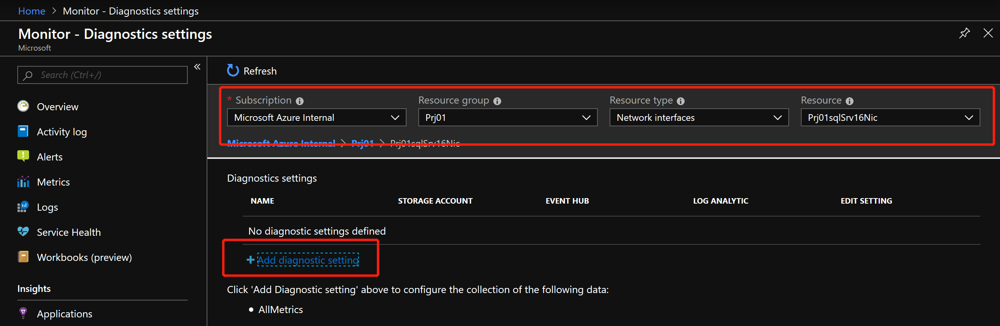

设置相应参数，将诊断日志保存在 Log Analytics 中，针对诊断日志，建议的命名方式为 `name-resource-diag`，便于后续的维护人员确认。

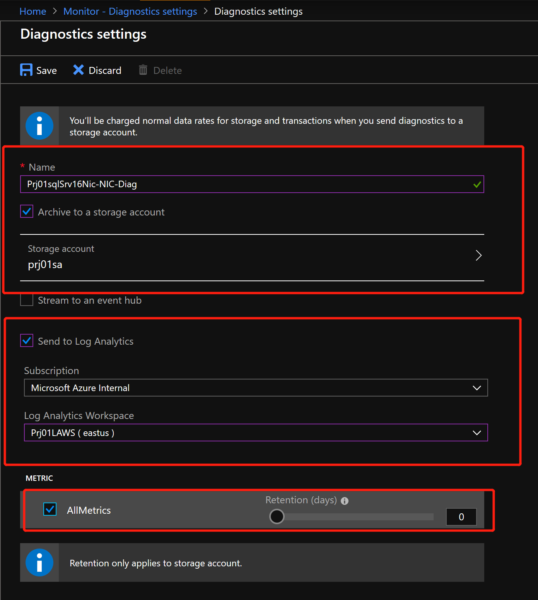

Step 2 为 VM 配置诊断设置，并读取到 `Log Analytics`

Azure中有一些特殊资源，例如 `Service Fabric` & `VM`, 他们设置诊断日志的时候，只能存储在Storage Account中。为了将数据可以集中于Log Analytics，我们可以在设置到存储账户后，设置Log Analytics，从存储账户中读取日志信息，以供后续的分析。我们可以在环境中按照项目，设置存储账户用来收集诊断日志信息。

本次实验的对象为 VM `LinuxVM01`。由于VM的诊断配置中，需要配置存储账户，会将所有的数据（Metrics&Logs）存放于此，因此，建议一个Project中使用一个存储账户存储所有VM的数据，便于管理。

进入选中的VM，点击 `Diagnostic settings`,  选择 `Storage Account` - `prj01sa`, 开启VM的诊断日志


检查诊断日志默认收集的数据


我们根据如上步骤，设置好`Prj01`中所有VM的诊断设置；设置好所有的VM之后，通过 Azure Portal，将存储账号与Log Analytics进行设置连接，这样，就可以通过Log Analytics统一接收并分析多个资源的日志数据。

进入 Log Analytics 工作区 `Prj01LAWS`, 并点击`Storage accounts log`, 添加`Add`


初次设置，需要等待30mins，就可以在 Log Analytics中看到数据。

> __*资料参考：*__
>- [如何在Portal设置诊断日志](https://docs.microsoft.com/zh-cn/azure/azure-monitor/platform/diagnostic-logs-stream-log-store#stream-diagnostic-logs-using-the-portal)
>- [在虚拟机中为事件日志和 IIS 日志收集启用 Azure 诊断](https://docs.microsoft.com/zh-cn/azure/azure-monitor/platform/azure-storage-iis-table#enable-azure-diagnostics-in-a-virtual-machine-for-event-log-and-iis-log-collection)
>- [使用 Azure 门户从 Azure 存储中收集日志](https://docs.microsoft.com/zh-cn/azure/azure-monitor/platform/azure-storage-iis-table#use-the-azure-portal-to-collect-logs-from-azure-storage)
>- [az vm diagnostics 详细解释](https://docs.microsoft.com/en-us/cli/azure/vm/diagnostics?view=azure-cli-latest)
>___

### 开启 AKS 的监控插件

AKS的监控可以选择在创建集群时开启，或者通过命令行进行开启。AKS的监控作为`Addons`存在，开启非常简单，只需要一条命令，即可了解集群的运行状况信息。

```
# 检查 AKS 集群是否 Enable Addon Monitoring，如果并未查询到结果，证明集群并未Enable Monitoring Addon
az aks show -n $yourAKSName -g Prj02 --query "addonProfiles.omsagent.enabled"

# 获取 Log Analytics Prj02LAWS 的ResourceID (需要将CLI版本升级到2.0.68及以上)
az resource show -n Prj02LAWS -g Prj02 --resource-type "microsoft.operationalinsights/workspaces" --query "id" -o tsv

# Enable Monitoring Addon for AKS
az aks enable-addons --addons monitoring --workspace-resource-id $yourLAID -n zjprj02 -g Prj02

# 复查 AKS 集群是否 Enable Addon Monitoring
az aks show -n $yourAKSName -g Prj02 --query "addonProfiles.omsagent.enabled"
```

>资料参考：
>- 如何开启AKS监控（现有集群）https://docs.microsoft.com/zh-cn/azure/azure-monitor/insights/container-insights-onboard
>___

---
## 可视化环境中的监控信息

在上一个章节，我们完成了对于不同资源，不同环境下的数据的收集工作，接下来，我们需要做的是通过可视化的手段，呈现资源目前的一个状态，对于运维人员来说，可以直观的了解到环境中的健康状况。

### 创建 Prj01 虚机&存储&网络监控 Dashboard

本次实验是创建一个Dashboard，用于定制化环境中虚机&存储&网络指标

创建一个名为 `Prj01-Infrastructure` 的Dashboard

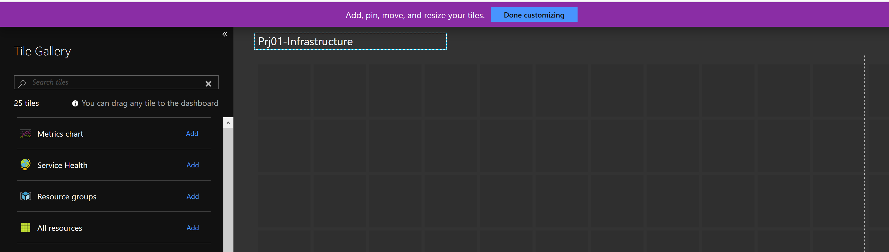

添加 `Metrics chart`


设置添加的`Metrics chart`, 配置 Title为 `VMs - Percentage CPU`，对象为 VM `LinuxVM01` & `Prj01sqlSrv16` & `Prj01VSSrv17`


在 Dashboard 中，我们就可以实时的观测到整个环境中虚机的情况，同时，可以根据需要，Drill down到每台虚机去查看具体情况。接下来，按照上述方式，设置 `VMs- Percentage Memory`, `VMs - Network In`, `VMs - Network Out`, `VMs - Disk Available`

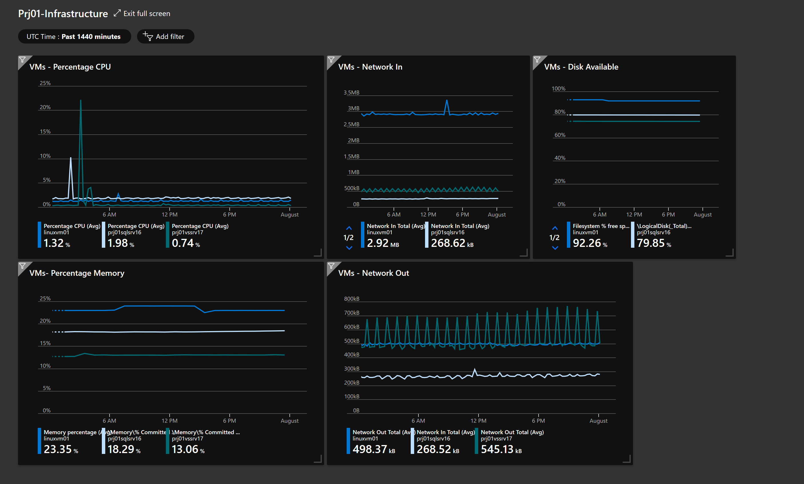

接下来，按照同样的方式，添加存储账户的监控指标，分别为`Storage Account - Availability`, `Storage Account - Used Capacity`, `Storage Account - Success E2E Latency(ms)`, `Storage Account - Blob Capacity`, `Storage Account - Table Capacity`

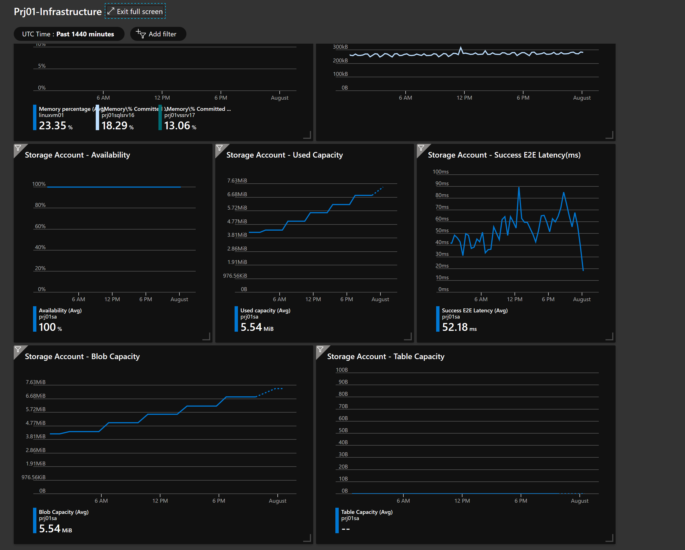

接下来，按照同样的方式，添加网络部分的监控指标，分别为`Network - Under DDoS or not`, `Network - NIC Bytes Sent`, `Network - NIC Bytes Received`


### 容器 AKS 监控 Dashboard

Azure Monitor专门针对AKS提供了一套完备的解决方案，`Azure Monitor for Containers`, 用来实现针对容器化环境实现端到端的监控与分析。


通过 `Azure Monitor - Insights Containers`，可以看到整个订阅下集群的统计信息及健康情况


点击单个集群，可以看到此集群详细的监控信息


可以看到针对于每个Container的详细信息


我们完全可以通过 `Azure Monitor - Insights Containers` 来监控每一个AKS集群，并在出现问题时快速定位问题


当然，我们也可以借助 `Azure Dashboard`, 定制针对于容器监控的 Dashboard, 呈现我们想要看到的信息；所有的监控信息，均通过开启 AKS Monitoring 插件实现，通过Agent，收集相关的Metrics及Logs信息。


创建名为 `Prj02 - Containers Monitoring` 的Dashboard, 并先将已有的可以描述集群性能的Metrics添加到Dashboard, `Node count` & `Active Pod count` & `Node Memory utilization` & `Node CPU utilization`

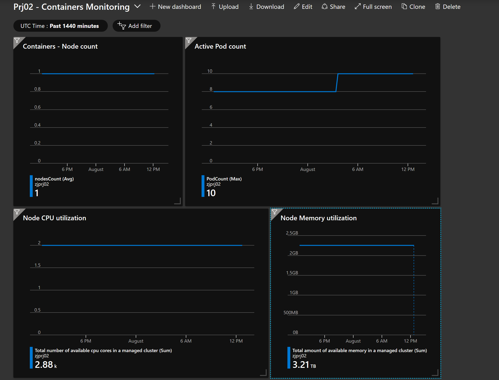

除了系统提供的Metrics外，我们可以借助于`Log Analytics`完成更多自定义的监控页面定制。

进入Prj02的Log Analytics `Prj02LAWS`, 运行如下的查询语句，获取当前环境中各容器CPU的使用占比，并将结果固定于Dashboard中

```
Perf
| where ObjectName == "K8SContainer" and CounterName == "cpuRequestNanoCores"
| summarize AvgCPUUsageNanoCores = avg(CounterValue)/1000000000 by bin(TimeGenerated, 30m), InstanceName
```

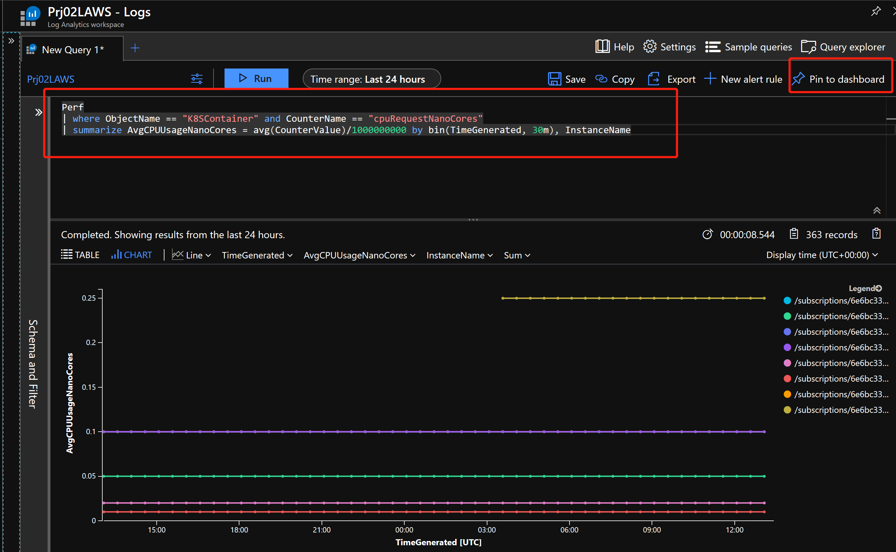

__*注意：*__ 当我们将Metrics与Logs混合放入Dashboard中时，一定要先将Dashboard变为Share Dashboard


运行如下语句，获取当前环境中不同Namespace的服务数量的比例，并将结果固定于Dashboard中

```
KubeServices 
| summarize AggregatedValue = dcount(ServiceName) by Namespace 
| order by AggregatedValue desc
```

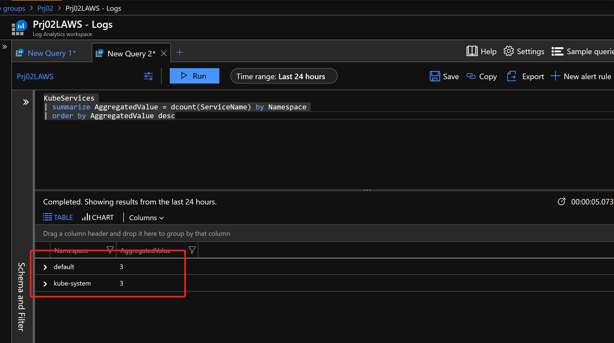


> 资料参考：
> [用于容器的 Azure Monitor 概述](https://docs.microsoft.com/zh-cn/azure/azure-monitor/insights/container-insights-overview)
> [如何查询 Azure 监视器中的容器的日志](https://docs.microsoft.com/zh-cn/azure/azure-monitor/insights/container-insights-log-search)

### 环境中通用信息

最后，我们创建一个 Dashboard, 名为`General - Dashboard`，用来设置环境中的快捷键，比如：`始终` & `Service Health` & `Help + Support`, 以及环境中各资源的数量。


---

## 完善环境中的警报机制及后期采取的行动

经过以上两组实验，我们针对实验环境收集了数据，并建立了监控大屏，让用户可以直观的了解环境目前的运行情况。但运维人员不能一刻不停的盯着大屏，运维人员需要的是能够在环境出问题的时候，第一时间获得通知，快速修复问题，这是提高环境自动化，优化环境可用性的一个关键。警报是监控系统的一种关键手段，合理的设置关键数据的警报，能够帮助运维人员更好且自动化的监控云端环境。

如下展示了一个警报的产生过程，和处理方式：

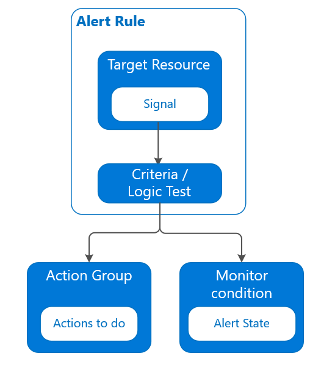

任何一个警报，都有几个关键的部分：`所针对的资源` & `触发的条件` & `警报级别` & `所采取的操作`

`Azure Alerts`支持为Azure中资源产生的`Metrics` & `Logs from Log Analytics` & `Activity Log` & `Azure 平台运行状况`等作为触发警报的数据源

`Azure Alerts`支持用户将警报定义为 `Sev0` & `Sev1` & `Sev2` & `Sev3` & `Sev4`五个等级，分别代表警报涉及的资源对当前环境的影响大小，`Sev0`最为严重

`Azure Alerts`支持用户设置不同的`Action Group`来相应不同级别的警报，响应手段包括`Email\SMS\电话` & `Webhook` & `Azure Function` & `Azure Logic Apps` & `Automation Runbook`等

### 预先规划好环境中的 Action Group

`Action Group`与`Alert Rules`是多对多的关系，双方可以互相匹配。因此在规划监控系统时，可以预先设定一些常用的通知手段，且随着自动化水平的增加，逐渐更新。

本次实验，先预先设定一些`Action Group`，主要针对环境中的警报提供`邮件/短信/电话`报警的支持。本次实验会设置三个`Action Group`，分别针对于`Admin` & `Prj01` & `Prj02`, 且`Admin`的只使用Email，`Prj01`使用`Email & SMS`，`Prj02`使用`Email`. 将完成`Admin` `Action Group`的设置，留下另外两个自行完成。

```
# 通过 Azure CLI 完成 Action Group的创建
az monitor action-group create -n General -g zjmon01 --short-name general --action email operation01 jianzsh0821@163.com

# 如果希望创建SMS的Action Group, 可通过如下命令查看完整参数
az monitor action-group create -h
```

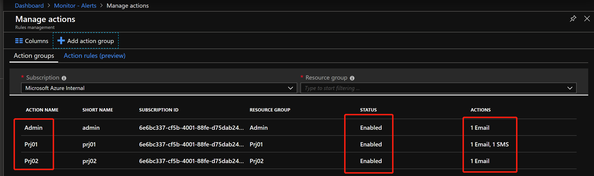

且设置生效后，相对应的邮箱或手机会收到设置成功的通知


__*参考资料：*__

- [语音、短信、电子邮件、Azure 应用推送通知和 webhook 帖子的速率限制](https://docs.microsoft.com/zh-cn/azure/azure-monitor/platform/alerts-rate-limiting)

- [在 Azure 门户中创建和管理器操作组](https://docs.microsoft.com/zh-cn/azure/azure-monitor/platform/action-groups)

### 设置警报规则

#### 针对活动日志设置警报

本次实验，针对活动日志设置警报，对于`Prj01`环境中所有`删除虚机`的操作，都需要邮件通知系统管理员，即通过`Prj01 - Action Group`来处理。除此之外，`重启虚机` & `关闭虚机`同样需要通知系统管理员，这两个警报的设置请自行完成。

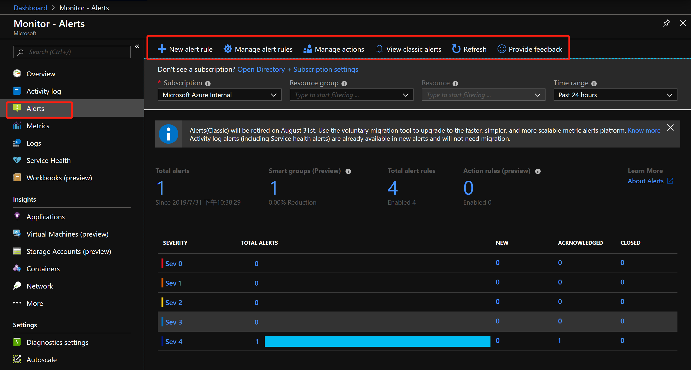

创建 Activity Log Alert 主要分三步：

Step 1 确定 `Scope`

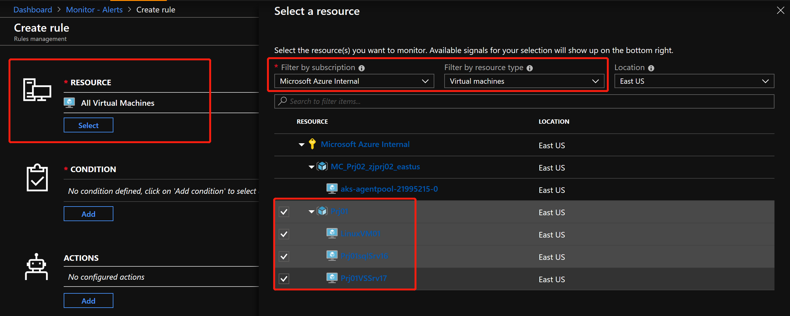

Step 2 确定 `触发条件`

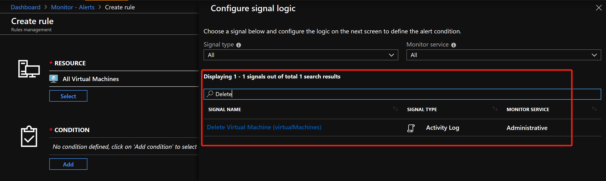

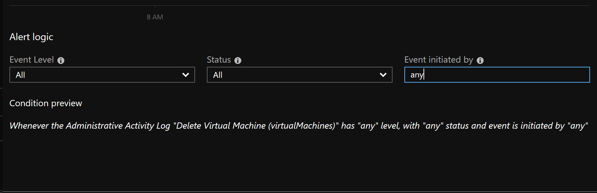

Step 3 确定 `Action Group`

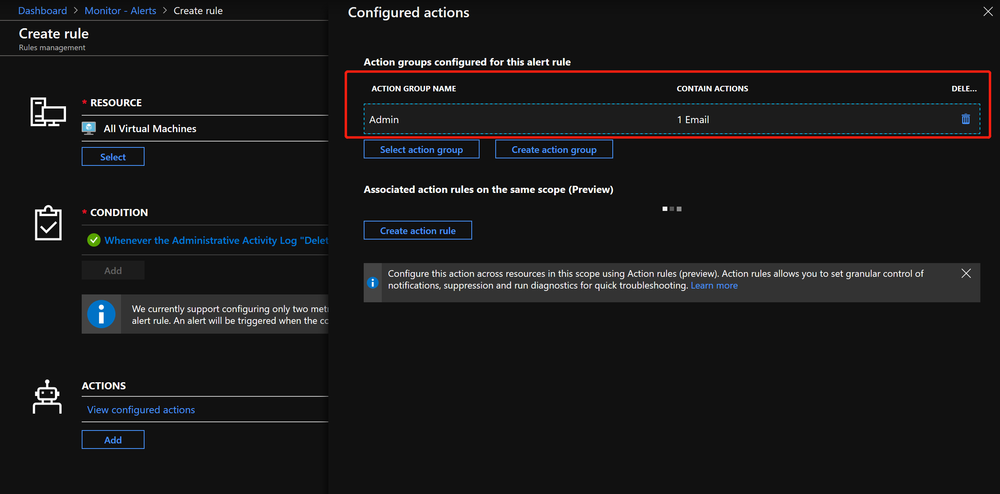

#### 针对Azure资源设置警报

本次实验，将模拟几个经常会遇到的场景，针对虚拟机，当`CPU超过75%`时，通知相应的人员进行处理；针对容器，当环境中出现`Pending的Pod`时，通知相应的人员进行处理；

本次实验所使用到的模板均存在于 [arm-templates](./files/monitor/arm-templates/) 下

```
# 本次实验将使用 Azure CLI 结合 ARM 模板完成
# 针对虚拟机，设置CPU报警
# 获取ResourceID，将针对RG下面的所有VM进行警报设置
az group show -n Prj01 --query id -o tsv

# 获取 Action Group ResourceID
az monitor action-group show -n Prj01 -g Prj01 --query 'id' -o tsv

# 创建针对CPU过高的告警
az group deployment create --name VMCPUAlertDeploy -g Prj01 --template-file monitor-vms-in-rg.json --parameters @vm-cpu-high.parameters.json --parameters targetResourceRegion="EastUS" --parameters '{ "targetResourceGroup": {"value": ["$rgID"]}}' --parameters actionGroupId='$actionGroupID'
```

当警报生效后，环境中的虚机出现CPU过高时，邮箱及手机就会收到如下警告：

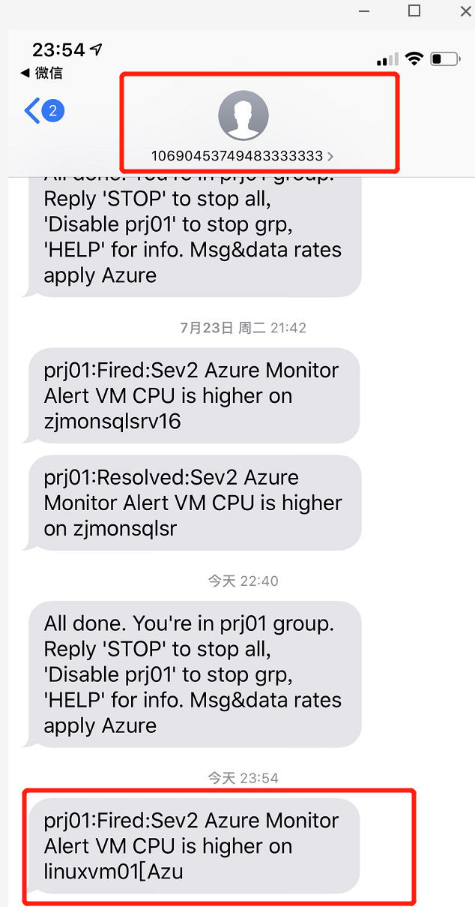


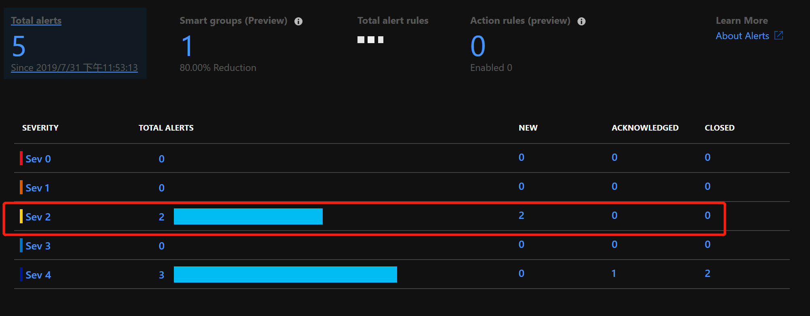

__*参考资料：*__

- [使用 Azure Monitor 创建、查看和管理指标警报](https://docs.microsoft.com/zh-cn/azure/azure-monitor/platform/alerts-metric)

- [使用 Resource Manager 模板创建指标警报](https://docs.microsoft.com/zh-cn/azure/azure-monitor/platform/alerts-metric-create-templates)

- [使用 Azure Monitor 创建、查看和管理日志警报](https://docs.microsoft.com/zh-cn/azure/azure-monitor/platform/alerts-log)

- [Azure Monitor 中的日志警报](https://docs.microsoft.com/zh-cn/azure/azure-monitor/platform/alerts-unified-log)

### 结合 Service Health & Resource Health，及时了解环境动态并设置告警

本次实验，将结合两个服务`Service Health` & `Resource Health`，设置相应的警报，确保当云平台或资源出现问题时，第一时间知晓。

`Service Health`是集中了解云平台中资源是否可用，或当平台出现问题时，及时了解问题进站及下载事故分析的地方


`Service Health`会提供包括`Service issue` & `Planned maintenance` & `Health advisories`在内的三种指标，建议在实际的生产环境中，针对这三种指标设置三个警报，分别对应特定`Action Group`, 确保不同问题能够找到合适处理的人。

本次实验将针对`Service issue`进行设置，另外两个的设置请自行练习。


Step 1 选择需要涉及的订阅，区域，服务以及事件类别


Step 2 选择Alert关联的`Action Group` 并进行创建


这样当下一次平台中选中的服务出现问题或出现维护公告时，你会第一时间收到消息，确保可以及早处理突发事件。

`Resource Health`是能够及时反映正在使用的某一个Azure资源是否因为平台出现的问题，达到`Limitation`, 或性能出现显著降低的一种监控指标

资源是指Azure提供的服务，例如：`Virtual Machines` & `Application Gateway`等, 资源的状态会在 `Available` & `Unavailable` & `Unknown` & `Degraded` 之间转换，只要资源不处于 `Available` 状态，除非是一些已知的原因，比如：`手动停机`，都应该发送相应的警报引起负责人员的重视，资源处于非`Available`状态证明当前环境中正存在一种或多种资源不能正常使用。


本次实验将针对资源组下的所有资源类型`Resource Health`设置警报，有关涉及到的 ARM Template 请参阅 [arm-templates](./files/monitor/arm-templates/) 下的相应文件。

```
# 本次实验将使用 Azure CLI 结合 ARM 模板完成
# 针对 Resource Health 进行告警设置，当资源组下的某一资源状态从Available改变成Unavailable,Unknown,Degraded时，发送警报通知运维人员
# 获取ResourceID
az group show -n Prj01 --query id -o tsv

# 获取 Action Group ResourceID
az monitor action-group show -n Prj01 -g Prj01 --query 'id' -o tsv

# 设置Resource Health的警报
az group deployment create --name ResourceHealth01 -g Prj01 --template-file monitor-resources-health.json --parameters activityLogAlertName="ResourceHealthAlert_Prj01" --parameters '{ "scopes": {"value": ["$rgID"]}}' --parameters actionGroupResourceId='$actionGroupID'
```

设置完成后，当出现平台性问题导致资源状态变化，或如实验中，手动触发停止VM，就会发送告警信息。


__*参考资料：*__

- [服务运行状况概述](https://docs.microsoft.com/zh-cn/azure/service-health/service-health-overview)

- [资源运行状况概述](https://docs.microsoft.com/zh-cn/azure/service-health/resource-health-overview)

- [Azure 资源运行状况中的资源类型和运行状况检查](https://docs.microsoft.com/zh-cn/azure/service-health/resource-health-checks-resource-types)

- [使用资源管理器模板创建资源运行状况警报](https://docs.microsoft.com/zh-cn/azure/service-health/resource-health-alert-arm-template-guide)

---
## 更多参考资料

- [Azure Monitor 数据源](https://docs.microsoft.com/zh-cn/azure/azure-monitor/platform/data-sources#operating-system-guest)

- [Cloud Governance Tools及需求mapping](https://azure.microsoft.com/en-gb/product-categories/management-tools/)

- [将Azure Monitor中的数据通过Eventhub导出到外部平台](https://docs.microsoft.com/zh-cn/azure/azure-monitor/platform/stream-monitoring-data-event-hubs)

- [Kusto Query Language (KQL) from Scratch](https://www.pluralsight.com/courses/kusto-query-language-kql-from-scratch)