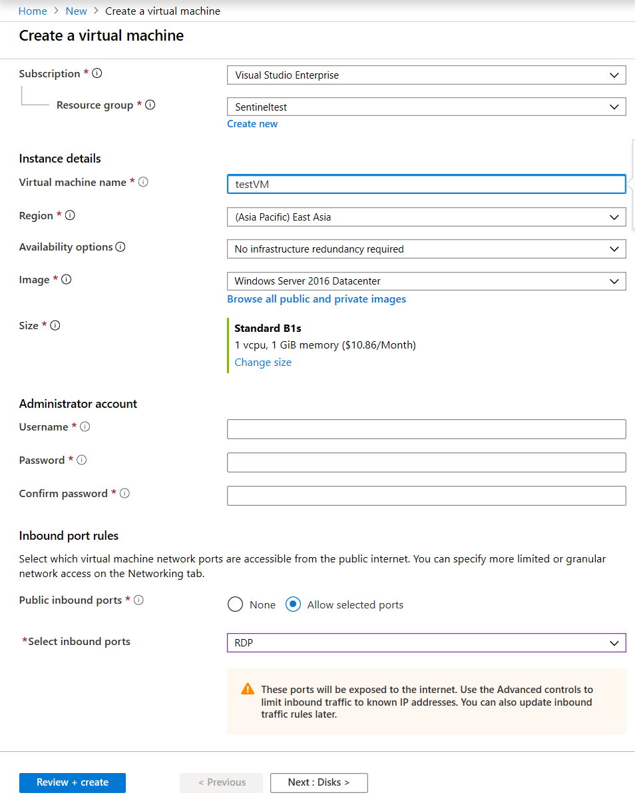
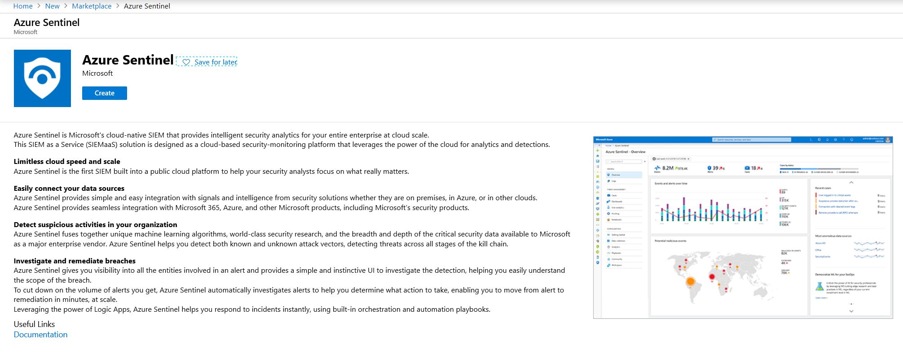
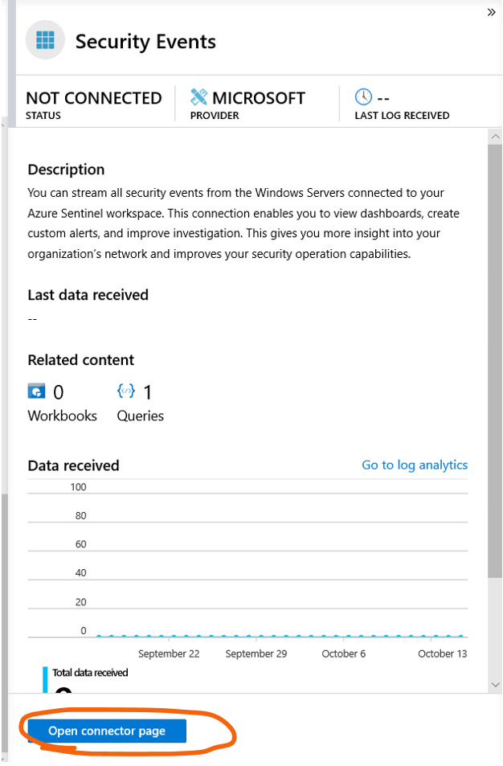
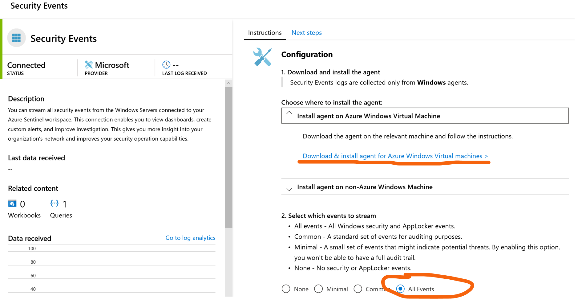
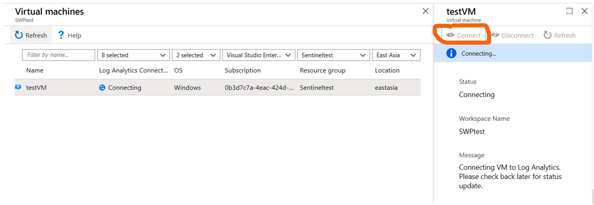
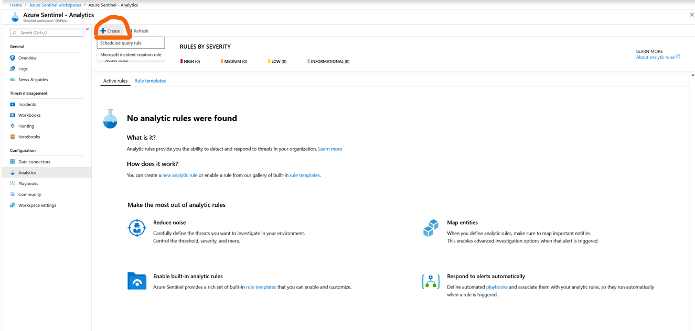
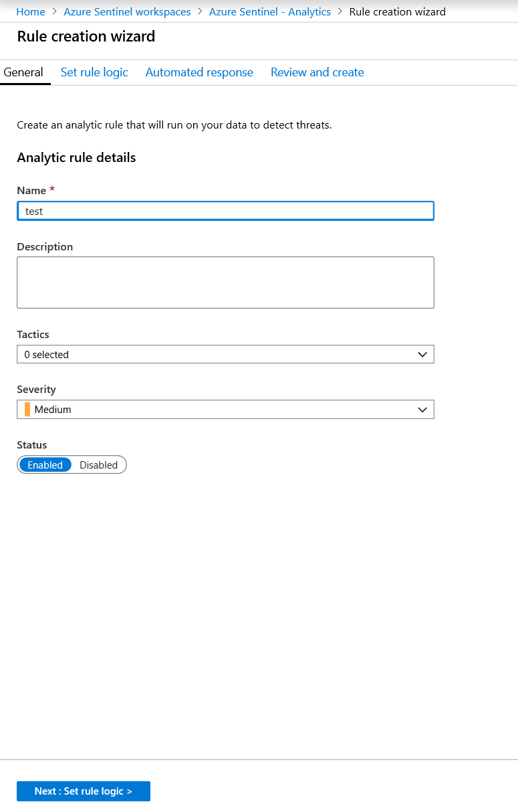
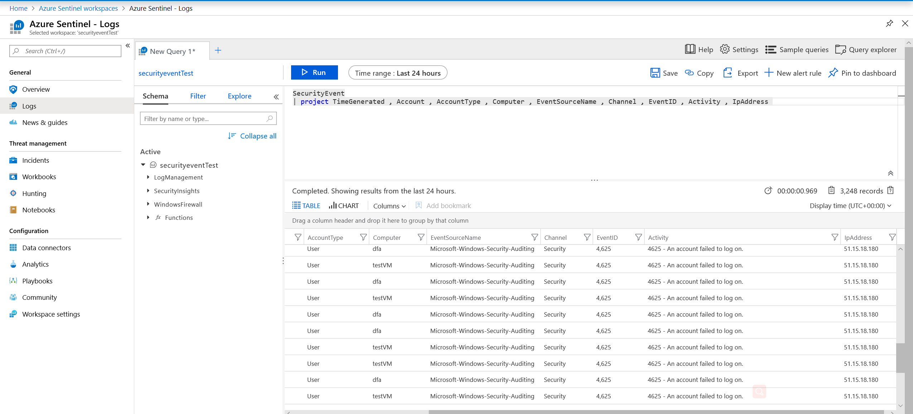
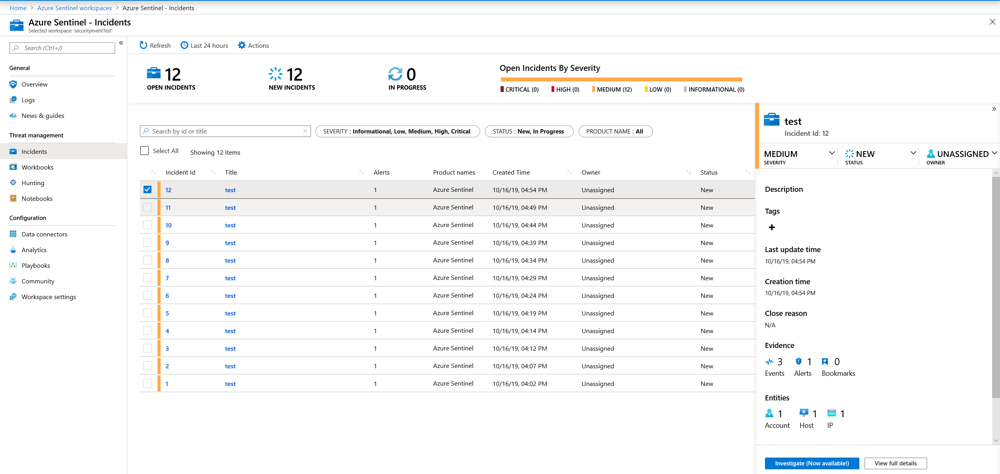
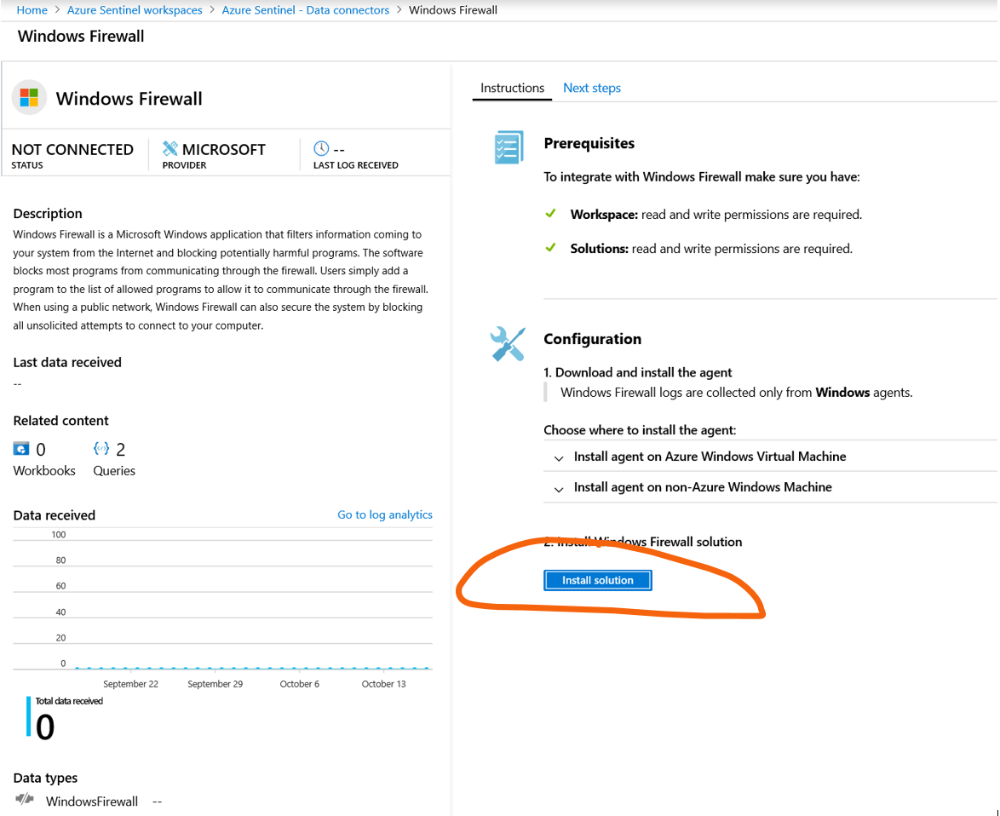

# Azure Sentinel 监控 Windows Security Event

在这一部分，我们将会在Azure Sentinel中配置Windows VM安全事件监测功能和防火墙功能。

## Step 1: Create Windows VM on Azure

### 登陆Azure Portal
打开 Azure Portal  https://portal.azure.com, 登陆账户密码

### 创建Windows虚拟机


 
注意参数：
-   `Resource Group` : 自定义
-	`virtual machine name` ：自定义
-	`Image` ：Windows Server 2016 Datacenter
-	`Size` : Standard B1s
-	`Username` & `Password` : 自定义
-	`Public inbound ports` : Allow selected ports (RDP)

## Step 2: 创建Sentinel实例

在 Azure Portal 中搜索 Sentinel，打开 Sentinel 页面。
点击 `+Add`，然后 `create a new workspace`，并连接到 `log Analysis`。Azure Sentinel实例依赖 `Log Analysis`，Azure Sentinel实例就相当于一个指向 `Log Analysis` 实例的软连接，可以通过 `Portal` / `Command Line` / `API` 等很多方式创建，我们这里采用 `Portal` 操作方式：


 
配置完成workspace，点击创建 `Azure Sentinel` 实例


 
## Step 3: Sentinel监测Windows VM的安全事件

打开 Sentinel, 从侧边栏选择 `Data connectors`；
选择 `Connector name` 为 `Security Events` 来实时监测Windows VM的安全事件；


 
点击 `open connector page`；



 
在连接器页面中，我们将agent安装到需要检测的Windows机器中。之前我们已经在Azure中创建了一台Windows VM，因此我们选择 `Download & install agent for Azure Windows virtual machine`;


 
点击 `Connect`, 然后 `Connect` 会变成灰色，表示正在连接Connecting


 
## Step 4: 配置Analytics Rule

接下来，我们来配置监测Windows密码登陆失败的Analytics规则，点击侧边栏中的 `Analytics`，然后点击  `+create`



 
编辑Analytic rule details，参数推荐：
-	`Name`： Monitor Windows Failed Logon
-	`Alert Severity` 选择 Medium


 
通过编辑 `kusto` 语句，对安全事件的 `log` 进行筛选和格式调整；


为了对Alert的事件进行筛选，我们配置Kusto语句如下：

```
SecurityEvent
| where EventID in (4728, 4729, 4732, 4733, 4756, 4757, 4625)
| extend ChangeType = case(EventID in (4729, 4733, 4757, 4625), "Member Removed", "Member Added")
| parse EventData with *'"TargetUserName">'TargetUserName'<'*
| where TargetAccount contains "azureuser"
| project ChangeType, ImpactedGroup=TargetAccount, ChangeMaker=Account, DC=Computer, Activity , IpAddress
```
上述代码可以直接复制，但要注意验证一下结果。
 
可以点击 `View query results` 预先分析验证 `Alter Query` 的运行结果


 
在 `Alert Query` 中可以查看到 windows 详细的 `EventID`，我们刚刚多次尝试的登陆失败，在事件中可以看到多条 `EventID` 为 4625 的事件产生（ `EventID` = 4625表示 `Failed logon`）。利用这种方式对管理员账户登陆失败进行实时监测，可以有效防止服务器被恶意攻击。在日常生活中，管理员账户登陆出现多次失败往往事攻击的早期现象，并可以通过添加 `playbooks` 配置安全措施。

Map Entity选择：

- `Account` -> ChangeMaker (Click `Add`)
- `Host` -> DC (Click `Add`)
- `IP address` -> IPAddress (Click `Add`)

之后 `Alter Query` 中会自动多出三行筛选内容：

```
| extend AccountCustomEntity = ChangeMaker
| extend HostCustomEntity = DC
| extend IPCustomEntity = IpAddress
```

然后配置 `Query Scheduling`, 配置 `Alter` 频率为5分钟，周期为 30minutes，当结果大于0次时产生alert，即如果 `failed logon` 一次，Sentinel中就会有相应的 `Incident Alert` 报告（这么配置是为了实验效果，真实环境中请根据需要配置参数）。

之后点击 `创建` 即可。

创建完 `Analytics Rule` 之后可以在 `Active rules` 中查看状态（`Enabled`）


为了验证 `Windows Security Event` 事件，我们通过 `Azure Portal` 打开Windows VM的 `RDP连接界面`，输入错误的密码，导致 `Failed logon` 事件产生。建议多操作几次登陆失败。

之后在Sentinel页面的侧边栏点击Incident，可以查看刚刚进行的Failed Logon事件:


 
你也可以点击 `Investigate`，通过图形化界面更直观的查看Security Event情况:


在 `Sentinel Overview` 中可以用Dashboard查看资源的监测状态:


## Step 5: Sentinel监测Windows Firewall

侧边栏导航至 `Data connectors`，创建 `windows firewall`的数据连接


之前已经连接到相应的Windows VM上因此可以直接点击 `Install solution`:



 

